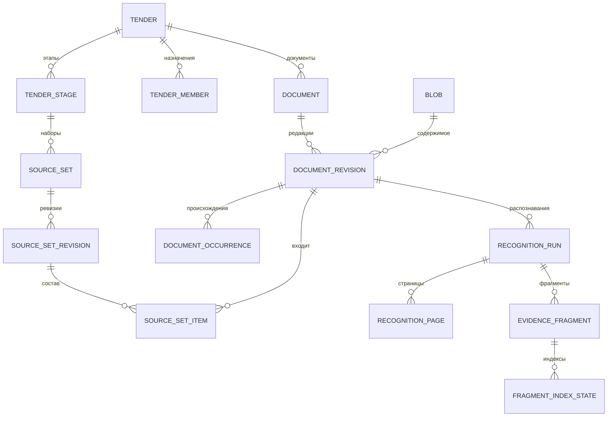
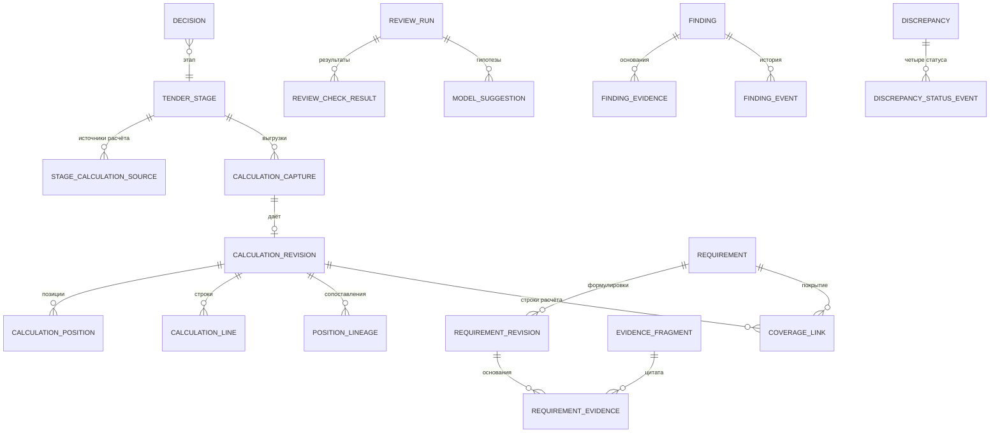
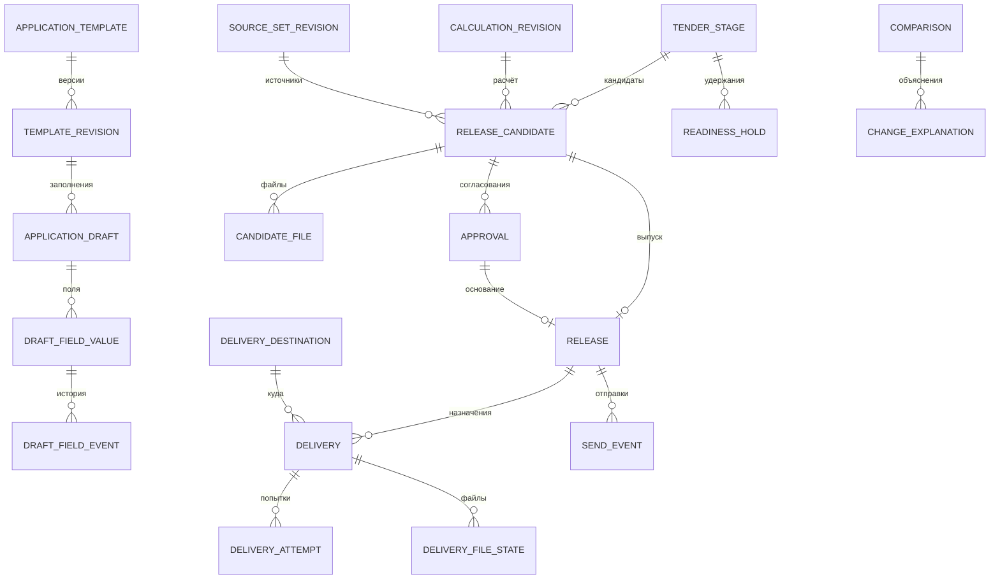
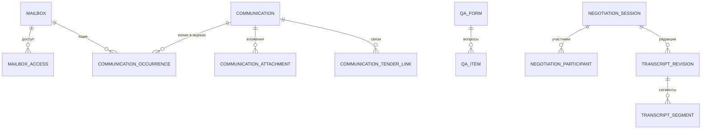

# Контур КП — модель данных

Этап 01. Проект схемы PostgreSQL. DDL пишется на этапе 02 и последующих; имена таблиц и состояний здесь канонические, остальные документы используют их без синонимов.

## 1. Общие правила

- **Ключи.** `id uuid` с `gen_random_uuid()`; внешние идентификаторы хранятся отдельными колонками или в `external_ref`, а не как первичные ключи.
- **Время.** Только `timestamptz`, хранение в UTC. Бизнес-даты без времени (дата цены поставщика) — `date` (ADR-005).
- **Деньги и количества.** Только `numeric` без float; исходная лексема числа из внешнего ответа хранится рядом, если значение участвует в сверке (ADR-005).
- **Изменяемость.** Каждая таблица относится к одному классу:

| Класс | Правило | Как обеспечивается |
|---|---|---|
| `immutable` | Строка после вставки не меняется и не удаляется приложением | Роль приложения не имеет `UPDATE/DELETE`; триггер `forbid_mutation` как вторая линия (ADR-002); оговорка I19 |
| `append-only` | Только новые строки событий; старые не меняются | То же |
| `frozen-after` | Изменяется до перехода в замороженное состояние, затем как `immutable` | Триггер проверяет состояние; переход — отдельная команда |
| `mutable` | Изменяется командами с `row_version` | `row_version bigint`, `If-Match`, аудит в `audit_event` |
| `derived` | Производные данные, можно пересобрать | Не источник истины (индекс, кэш) |

- **Область тендера.** Все данные, относящиеся к тендеру, несут `tender_id` (прямо или через однозначного родителя). Доступ — только через слой данных с `AccessContext` (ADR-006).
- **Происхождение.** Всё, что пришло извне, хранит систему, внешний ID, время получения и хэш исходного ответа или файла.
- **Автор.** Команды человека пишут `actor_user_id`; действия сервисов — `principal_id` сервисной учётной записи и, для MCP, `on_behalf_of_user_id`.

Валюты: `RUB`, `USD`, `EUR`, `CNY` и `UNKNOWN` (D-004). Признак НДС: `included`, `excluded`, `not_applicable`, `unknown`. Вид цены: `cost` (себестоимость), `supplier_quote` (цена поставщика), `commercial` (коммерческая цена), `unknown`.

## 2. Карта контекстов

| Контекст | Таблицы | Владелец данных (источник истины) |
|---|---|---|
| Доступ | `app_user`, `user_role`, `tender_member`, `session`, `api_token`, `mailbox`, `mailbox_access` | Портал |
| Тендеры | `tender`, `tender_stage`, `stage_calculation_source`, `external_ref` | Портал; внешние ID — системы-источники |
| Источники | `blob`, `document`, `document_revision`, `document_occurrence`, `import_batch`, `import_item`, `source_set`, `source_set_revision`, `source_set_item` | Портал (оригиналы и состав) |
| Распознавание и доказательства | `recognition_run`, `recognition_page`, `evidence_fragment`, `fragment_index_state` | RDWeb/LocalAI — обработка; портал — неизменяемая копия доказательств |
| Расчёт | `calculation_capture`, `calculation_revision`, `calculation_position`, `calculation_line`, `position_lineage` | TenderHub — расчёт; портал — снимок ревизии |
| Коммуникации | `communication`, `communication_occurrence`, `communication_attachment`, `communication_tender_link`, `qa_form`, `qa_item`, `negotiation_session`, `negotiation_participant`, `transcript_revision`, `transcript_segment` | MailHub и сервис переговоров — первичные данные; портал — связи и копии доказательств |
| Требования и проверки | `requirement`, `requirement_revision`, `requirement_evidence`, `coverage_link`, `review_run`, `review_check_result`, `model_suggestion`, `finding`, `finding_evidence`, `finding_event`, `discrepancy`, `discrepancy_status_event`, `decision`, `question`, `risk_acceptance`, `evidence_dependency` | Портал |
| Приложения | `application_template`, `template_revision`, `approved_wording`, `application_draft`, `draft_field_value`, `draft_field_event` | Портал; реальные формы — владелец процесса |
| Выпуск | `release_candidate`, `candidate_file`, `approval`, `readiness_hold`, `release` | Портал |
| Размещение и отправка | `delivery_destination`, `delivery`, `delivery_attempt`, `delivery_file_state`, `send_event` | Портал; хранилища — копии |
| Сравнение | `comparison`, `change_explanation` | Портал |
| Сервисные | `audit_event`, `job`, `idempotency_record`, `integration_status`, `sync_cursor`, `setting` | Портал |

Соответствие сущностям спецификации (§4): Tender → `tender`; TenderStage → `tender_stage`; CalculationRevision → `calculation_revision`; Document / DocumentRevision → `document` / `document_revision`; RecognitionRun / EvidenceFragment → `recognition_run` / `evidence_fragment`; SourceSetRevision → `source_set_revision`; Requirement / CoverageLink → `requirement` / `coverage_link`; Communication / QuestionAnswer / Negotiation → `communication` / `qa_item` / `negotiation_session`; Decision / Discrepancy / Finding → `decision` / `discrepancy` / `finding`; ApplicationTemplate / ApplicationDraft → `application_template` / `application_draft`; ReviewRun → `review_run`; ReleaseCandidate / Approval / Release → `release_candidate` / `approval` / `release`; Delivery / SendEvent → `delivery` / `send_event`; ChangeExplanation → `change_explanation`; AuditEvent / Job → `audit_event` / `job`.

## 3. ER-схемы

### 3.1. Тендер, источники, доказательства

### 3.2. Расчёт, требования, проверки

### 3.3. Приложения, выпуск, размещение, отправка

### 3.4. Коммуникации и переговоры

## 4. Каталог таблиц

Колонки `created_at`, `row_version` и аудиторские поля перечислены только там, где они важны для правила.

### 4.1. Доступ

| Таблица | Класс | Ключевые колонки | Ограничения |
|---|---|---|---|
| `app_user` | mutable | `kind` (`human`/`service`), `service_kind` (`integration`/`model`/`system`, только для service), `login`, `display_name`, `password_hash` (только human), `status` (`active`/`disabled`) | `login` уникален; у service нет пароля |
| `user_role` | mutable | `user_id`, `role` (`admin`/`manager`/`engineer`) | роли только у `human` (триггер) |
| `tender_member` | mutable | `tender_id`, `user_id`, `member_role` (`engineer`/`manager`), `assigned_by`, `assigned_at`, `removed_at` | активных инженеров на тендер не больше двух (проверка в транзакции назначения); только `human` |
| `session` | mutable | `token_hash`, `user_id`, `csrf_hash`, `expires_at`, `revoked_at`, `last_seen_at` | хранится хэш, не токен |
| `api_token` | mutable | `user_id`, `client_kind` (`mcp_codex`/`mcp_cursor`/`other`), `token_hash`, `scopes` (`read`, `propose`), `expires_at`, `revoked_at` | нет областей `approve`/`release`/`send`/`admin` на уровне схемы (CHECK) |
| `mailbox` | mutable | `system` (`mailhub`), `external_account_id`, `address` | (`system`, `external_account_id`) уникальны |
| `mailbox_access` | mutable | `mailbox_id`, `user_id`, `source` (`manual`/`mailhub_sync`), `granted_by`, `revoked_at` | один активный доступ на пару |

### 4.2. Тендеры

| Таблица | Класс | Ключевые колонки | Ограничения |
|---|---|---|---|
| `tender` | mutable | `code`, `title`, `customer_name`, `object_name`, `status` (`active`/`archived`) | `code` уникален |
| `tender_stage` | mutable | `tender_id`, `seq`, `title`, `submission_deadline`, `status` (`active`/`archived`), `kp_total_rule` | (`tender_id`, `seq`) уникальны. Готовность, согласование, выпуск и отправка не хранятся в статусе этапа, а выводятся из событий (I01) |
| `stage_calculation_source` | mutable | `stage_id`, `system` (`tenderhub`), `external_tender_id`, `external_version`, `role` (`primary`/`reference`) | один `primary` на этап; связь этап ↔ версия TenderHub настраивается (Q-03) |
| `external_ref` | immutable | `entity_type`, `entity_id`, `system`, `external_id`, `external_version`, `observed_at` | (`system`, `external_id`, `external_version`, `entity_type`) уникальны |

### 4.3. Источники

| Таблица | Класс | Ключевые колонки | Ограничения |
|---|---|---|---|
| `blob` | immutable | `sha256` (PK), `size_bytes`, `media_type`, `storage_key`, `verified_at` | файл в хранилище с тем же хэшем (ADR-003) |
| `document` | mutable | `tender_id`, `title`, `doc_type` (`tz`/`pd`/`rd`/`contract`/`boq`/`qa_form`/`letter`/`minutes`/`supplier_quote`/`other`), `doc_code`, `scope_note` | метаданные с `row_version`; логическая группировка подтверждается инженером |
| `document_revision` | immutable | `document_id`, `blob_sha256`, `revision_label`, `issued_at`, `received_at`, `supersedes_revision_id`, `registered_by` | (`document_id`, `blob_sha256`) уникальны: одно содержимое — одна редакция документа (A13, A14) |
| `document_occurrence` | append-only | `document_revision_id`, `source_kind` (`upload`/`watched_folder`/`archive_member`/`yandex_disk`/`smb`/`mail_attachment`/`rdweb_export`), `source_locator`, `observed_name`, `observed_at`, `import_item_id` | путь — история происхождения, не идентичность |
| `import_batch` | frozen-after | `tender_id`, `stage_id`, `source_kind`, `status` (`running`/`completed`/`completed_with_errors`/`failed`), `job_id`, `idempotency_key` | замораживается при завершении |
| `import_item` | frozen-after | `batch_id`, `member_path`, `status` (`pending`/`skipped_partial`/`rejected`/`registered`/`duplicate`), `reject_reason` (`path_traversal`/`size_limit`/`type_not_allowed`/`unstable_file`/`corrupt`), `blob_sha256` | отказ — строка со статусом, а не пропажа файла |
| `source_set` | mutable | `stage_id`, `purpose` (`working`/`review`/`release`) | — |
| `source_set_revision` | frozen-after | `source_set_id`, `seq`, `status` (`draft`/`frozen`), `base_revision_id`, `frozen_at`, `frozen_by`, `content_hash` | после `frozen` состав и хэш не меняются |
| `source_set_item` | frozen-after | `source_set_revision_id`, `document_revision_id`, `inclusion` (`included`/`excluded_not_applicable`/`inherited`), `decided_by`, `reason` | (`source_set_revision_id`, `document_revision_id`) уникальны; меняется только пока ревизия `draft` |

### 4.4. Распознавание и доказательства

| Таблица | Класс | Ключевые колонки | Ограничения |
|---|---|---|---|
| `recognition_run` | frozen-after | `document_revision_id`, `engine` (`rdweb_export`/`rdweb_api`/`text_layer`/`local_ocr`), `engine_schema_version`, `source_artifact_sha256`, `status` (`queued`/`running`/`complete`/`partial`/`failed`), `pages_total`, `pages_recognized`, `quality`, `supersedes_run_id` | после финального статуса неизменна; новый OCR — новая строка (A10) |
| `recognition_page` | immutable | `run_id`, `page_index`, `page_label`, `sheet_label`, `width_px`, `height_px`, `rotation`, `status` (`recognized`/`missing`/`failed`) | (`run_id`, `page_index`) уникальны |
| `evidence_fragment` | immutable | `run_id` или `transcript_segment_id` или `communication_id`, `document_revision_id`, `origin` (см. ниже), `fragment_kind`, `external_block_id`, `page_index`, `bbox_norm numeric[4]`, `rotation`, `text`, `text_sha256`, `derived_model_ref` | ID портала стабилен; текст не редактируется; `bbox_norm` в координатах страницы без поворота |
| `fragment_index_state` | derived | `fragment_id`, `index_system` (`localai`/`portal_fts`), `index_version`, `status`, `indexed_at` | можно удалить и пересобрать (I15, A42) |

Значения `evidence_fragment.origin` (I06): `document_text` (текстовый слой или текст документа), `recognized_text` (RDWeb/OCR), `model_description` (описание, summary, verification модели), `negotiation_speech` (реплика транскрипции), `negotiation_hint` (подсказка сервиса переговоров), `email_body`, `attachment_text`. Решение человека фрагментом не является и хранится в `decision`.

### 4.5. Расчёт

| Таблица | Класс | Ключевые колонки | Ограничения |
|---|---|---|---|
| `calculation_capture` | frozen-after | `stage_id`, `external_tender_id`, `capture_kind` (`portal_capture`/`tenderhub_revision`), `status` (`capturing`/`complete`/`inconsistent`/`failed`), `raw_bundle_sha256`, `contract_version`, `consistency` (до/после: `updated_at`, итог, число позиций и строк), `idempotency_key` | сырые ответы в `blob` |
| `calculation_revision` | immutable | `stage_id`, `capture_id`, `seq`, `kind` (`provisional`/`verified`), `external_revision_ref` (после X-01), `closed_at_source`, `kp_total`, `kp_total_currency`, `fx_rates` (USD/EUR/CNY с датой), `content_hash`, `supersedes_revision_id` | новая выгрузка — новая ревизия; прежняя не меняется (A07) |
| `calculation_position` | immutable | `revision_id`, `external_position_id`, `position_number`, `item_no`, `work_name`, `unit_code`, `volume`, `manual_volume`, `manual_note`, `client_note`, `is_section`, `is_additional`, `hierarchy_level`, `parent_external_position_id`, суммы позиции | (`revision_id`, `external_position_id`) уникальны |
| `calculation_line` | immutable | `revision_id`, `external_item_id`, `external_position_id`, `item_type`, `material_type`, `description`, `unit_code`, `quantity`, `unit_rate`, `currency`, `delivery_price_type`, `delivery_amount`, `total_amount` (вид `cost`), `commercial_markup`, `total_commercial_material`, `total_commercial_work` (вид `commercial`), `quote_link`, `quote_price_date`, `quote_valid_until`, `cost_category`, `raw_lexemes` | (`revision_id`, `external_item_id`) уникальны |
| `position_lineage` | append-only | `from_revision_id`, `from_external_position_id`, `to_revision_id`, `to_external_position_id`, `method` (`source_lineage`/`exact_key`/`manual`), `confidence`, `status` (`proposed`/`confirmed`/`rejected`), `decided_by` | разделение и слияние — несколько строк (A22) |

### 4.6. Коммуникации и переговоры

| Таблица | Класс | Ключевые колонки | Ограничения |
|---|---|---|---|
| `communication` | immutable | `kind` (`email`), `message_id_header`, `dedupe_key`, `subject`, `sent_at`, `direction` (`inbound`/`outbound`/`unknown`), `from_address`, `participants`, `in_reply_to`, `references`, `body_origin_sha256` | `dedupe_key` уникален: одно логическое письмо (A34) |
| `communication_occurrence` | append-only | `communication_id`, `mailbox_id`, `external_item_id`, `folder`, `source` (`mailhub_api`/`eml_import`), `observed_at` | видимость письма — через доступ к ящику хотя бы одного вхождения (A35) |
| `communication_attachment` | immutable | `communication_id`, `blob_sha256`, `filename`, `external_attachment_id`, `document_revision_id` | доступ как у письма |
| `communication_tender_link` | append-only | `communication_id`, `tender_id`, `stage_id`, `status` (`suggested`/`confirmed`/`rejected`), `decided_by` | автоматическая связь только `suggested` |
| `qa_form` | immutable | `tender_id`, `document_revision_id`, `form_revision_label` | новая редакция формы — новая строка |
| `qa_item` | immutable | `qa_form_id`, `question_no`, `question_fragment_id`, `answer_fragment_id`, `answer_state` (`empty`/`answered`/`replaced`), `replaces_item_id` | (`qa_form_id`, `question_no`) уникальны |
| `negotiation_session` | immutable | `tender_id`, `external_session_id`, `started_at`, `source` (`manifest_import`/`service_api`), `audio_ref`, `audio_sha256` | — |
| `negotiation_participant` | immutable | `session_id`, `speaker_label`, `name`, `side` (`customer`/`contractor`/`unknown`) | — |
| `transcript_revision` | immutable | `session_id`, `seq`, `source_artifact_sha256`, `supersedes_revision_id` | исправление транскрипции — новая редакция |
| `transcript_segment` | immutable | `revision_id`, `segment_no`, `speaker_label`, `t_start_ms`, `t_end_ms`, `segment_kind` (`speech`/`hint`), `text` | подсказка — отдельный вид, не речь (A03) |

### 4.7. Требования, проверки, решения

| Таблица | Класс | Ключевые колонки | Ограничения |
|---|---|---|---|
| `requirement` | mutable | `tender_id`, `stage_id`, `code`, `current_revision_id`, `status` (`candidate`/`confirmed`/`rejected`/`superseded`) | переход статуса — командой с `row_version` |
| `requirement_revision` | immutable | `requirement_id`, `seq`, `statement`, `parameters`, `scope` (объект, секция, этаж, помещение), `origin` (`human`/`model_suggestion`), `model_suggestion_id`, `authored_by` | правка формулировки — новая ревизия, цитаты сохраняются |
| `requirement_evidence` | immutable | `requirement_revision_id`, `fragment_id`, `role` (`basis`/`context`) | фрагмент должен входить в область этапа |
| `coverage_link` | mutable | `requirement_id`, `calculation_revision_id`, `external_position_id`, `external_item_id`, `kind` (`explicit_line`/`complex_rate`/`assumption`), `status` (`proposed`/`confirmed`/`rejected`/`stale`), `decided_by` | many-to-many (A05) |
| `review_run` | frozen-after | `stage_id`, `source_set_revision_id`, `calculation_revision_id`, `rules_version`, `model_config`, `status` (`queued`/`running`/`completed`/`completed_with_gaps`/`failed`), `coverage` (документы, страницы, распознано, ошибки) | входы закреплены; результат после финала неизменен (I18) |
| `review_check_result` | immutable | `run_id`, `check_code`, `outcome` (`passed`/`failed`/`not_applicable`/`incomplete`/`error`), `details`, `evidence_refs` | `incomplete` не считается `passed` |
| `model_suggestion` | frozen-after | `run_id`, `suggestion_kind` (`requirement_candidate`/`discrepancy_hypothesis`/`change_reason`/`field_value`/`question_draft`/`finding_proposal`), `payload`, `cited_fragment_ids`, `model_ref`, `prompt_hash`, `input_scope_hash`, `status` (`open`/`accepted`/`rejected`/`expired`), `request_id`, `created_by_principal`, `decided_by` | (`created_by_principal`, `request_id`) уникальны (A37); принять может только human |
| `finding` | mutable | `tender_id`, `stage_id`, `finding_kind`, `title`, `severity` (`critical`/`major`/`minor`), `confidence` (`low`/`medium`/`high`), `status` (`open`/`in_progress`/`resolved`/`accepted_risk`/`rejected`/`stale`), `owner_user_id`, `action`, `impact` (сумма с основанием или «не рассчитано»), `origin` (`rule`/`model_suggestion`/`human`) | критичность и уверенность — разные поля |
| `finding_evidence` | immutable | `finding_id`, `side` (`left`/`right`/`context`), `fragment_id` или ссылка на строку расчёта или поле приложения | — |
| `finding_event` | append-only | `finding_id`, `from_status`, `to_status`, `reason`, `actor_user_id` | история решений |
| `discrepancy` | mutable | `tender_id`, `stage_id`, `topic`, `finding_id`, текущие значения четырёх статусов | четыре оси I09 независимы |
| `discrepancy_status_event` | append-only | `discrepancy_id`, `axis` (`customer_position`/`calculation`/`proposal`/`documents`), `value`, `basis_fragment_ids`, `actor_user_id` | значения осей — §4.7.1 |
| `decision` | immutable | `tender_id`, `stage_id`, `subject_type`, `subject_id`, `decision_type`, `statement`, `rationale`, `basis_fragment_ids`, `decided_by` (только human), `supersedes_decision_id` | новое решение заменяет, старое остаётся |
| `question` | mutable | `tender_id`, `stage_id`, `text`, `status` (`draft`/`sent`/`answered`/`closed`), `qa_item_id`, `origin` | — |
| `risk_acceptance` | immutable | `stage_id`, `candidate_id`, `blocker_code`, `reason`, `accepted_by` (manager), `accepted_at` | только для бизнес-блокеров (§5 state-machines) |
| `evidence_dependency` | append-only | `dependent_type`, `dependent_id`, `depends_on_type` (`document_revision`/`fragment`/`calculation_revision`/`decision`), `depends_on_id` | основа инвалидации (stale) |

#### 4.7.1. Оси статусов разногласия (I08, I09)

| Ось | Значения |
|---|---|
| `customer_position` | `unknown`, `proposed_by_contractor`, `discussed_orally`, `agreed_in_writing`, `rejected_by_customer` |
| `calculation` | `not_reflected`, `partially_reflected`, `reflected`, `not_applicable` |
| `proposal` | `not_reflected`, `reflected`, `not_applicable` |
| `documents` | `not_fixed`, `fixed_in_tz`, `fixed_in_contract`, `not_applicable` |

`discussed_orally` не равно `agreed_in_writing`: устная реплика или подсказка переговоров не переводит ось в согласие (A03).

### 4.8. Приложения

| Таблица | Класс | Ключевые колонки | Ограничения |
|---|---|---|---|
| `application_template` | mutable | `owner_kind` (`company`/`customer`), `tender_id` (для формы заказчика), `name` | — |
| `template_revision` | frozen-after | `template_id`, `seq`, `source_blob_sha256`, `field_schema`, `status` (`draft`/`approved`), `approved_by`, `is_demo` | демо-шаблон помечен и не допускается к production-выпуску |
| `approved_wording` | immutable | `text`, `tags`, `approved_by`, `supersedes_id` | библиотека утверждённых формулировок |
| `application_draft` | mutable | `stage_id`, `template_revision_id`, `status` (`in_progress`/`complete`) | — |
| `draft_field_value` | mutable | `draft_id`, `field_key`, `value`, `value_origin` (`approved_wording`/`model_suggestion`/`manual`/`decision`), `basis_refs`, `status` (`empty`/`suggested`/`accepted`/`edited`/`needs_discussion`/`stale`) | ручной текст не стирается при `stale` |
| `draft_field_event` | append-only | `field_value_id`, `from_status`, `to_status`, `old_value`, `new_value`, `actor_user_id` или `principal_id` | история правок (A09) |

### 4.9. Выпуск

| Таблица | Класс | Ключевые колонки | Ограничения |
|---|---|---|---|
| `release_candidate` | frozen-after | `stage_id`, `seq`, `status` (`assembling`/`assembly_failed`/`ready_for_approval`/`approved`/`returned`/`superseded`/`released`), `calculation_revision_id`, `source_set_revision_id`, `review_run_ids`, `decision_set_hash`, `template_revision_ids`, `manifest_sha256`, `content_hash` | содержимое неизменно с `ready_for_approval`; меняется только статус переходами (§5 state-machines) |
| `candidate_file` | immutable | `candidate_id`, `path`, `blob_sha256`, `size_bytes`, `audience` (`customer`/`internal`), `media_type` | (`candidate_id`, `path`) уникальны |
| `approval` | frozen-after | `candidate_id`, `candidate_content_hash`, `approved_by`, `approved_at`, `comment`, `status` (`active`/`revoked`/`superseded`), `revoked_by`, `revoked_at` | частичный уникальный индекс: одно `active` на кандидата; `approved_by` — human с ролью manager в тендере (триггер) |
| `readiness_hold` | frozen-after | `stage_id`, `candidate_id`, `trigger_type` (`new_document_revision`/`new_communication`/`new_calculation_revision`), `trigger_id`, `status` (`open`/`resolved_not_applicable`/`resolved_requires_new_candidate`), `decision_id`, `resolved_by` | открытое удержание блокирует выпуск и регистрацию отправки (I04) |
| `release` | immutable | `candidate_id` (уникален), `approval_id`, `released_by`, `released_at`, `manifest_sha256`, `content_hash` | один выпуск на кандидата (A26); `content_hash` = `approval.candidate_content_hash`; `released_by` — назначенный инженер-human (триггер) |

### 4.10. Размещение и отправка

| Таблица | Класс | Ключевые колонки | Ограничения |
|---|---|---|---|
| `delivery_destination` | mutable | `kind` (`yandex_disk`/`smb`), `environment` (`test`/`production`), `root_locator`, `include_internal`, `active` | корень ограничен настройкой; секреты не в БД (ADR-006) |
| `delivery` | mutable | `release_id`, `destination_id`, `status` (§5 state-machines), `attempt_count`, `last_error_code`, `row_version` | (`release_id`, `destination_id`) уникальны: назначения независимы (A28) |
| `delivery_attempt` | append-only | `delivery_id`, `seq`, `started_at`, `finished_at`, `outcome`, `error_code` | — |
| `delivery_file_state` | mutable | `delivery_id`, `path`, `blob_sha256`, `remote_state` (`absent`/`staged`/`committed`/`verified`/`conflict`/`unknown`), `remote_fingerprint`, `checked_at` | перезапись файла с другим хэшем запрещена (A30) |
| `send_event` | frozen-after | `release_id`, `channel` (`email`/`customer_portal`/`paper`/`other`), `sent_at`, `recipients`, `evidence_kind` (`mailhub_message`/`uploaded_file`/`manual_note`), `evidence_ref`, `attachment_check` (`matched`/`mismatched`/`not_checked`), `status` (`registered`/`verified`/`disputed`), `registered_by`, `idempotency_key` | (`registered_by`, `idempotency_key`) уникальны; письмо не доказывает получение (A46) |

### 4.11. Сравнение

| Таблица | Класс | Ключевые колонки | Ограничения |
|---|---|---|---|
| `comparison` | frozen-after | `tender_id`, `left_release_id`, `right_release_id`, `method_version`, `decomposition_method`, `status` (`computing`/`ready`/`failed`) | обе стороны — выпуски, не текущие папки |
| `change_explanation` | mutable | `comparison_id`, `subject_type`, `subject_ref`, `delta` (сумма, валюта, НДС, вид цены), `components` (объём/цена/курс по методике), `reason_kind` (`document`/`answer`/`supplier`/`internal_decision`/`unknown`), `reason_status` (`hypothesis`/`confirmed`/`unknown`), `evidence_refs`, `confirmed_by` | строка `unexplained_remainder` обязательна (I11, A20, A23) |

### 4.12. Сервисные

| Таблица | Класс | Ключевые колонки | Ограничения |
|---|---|---|---|
| `audit_event` | append-only | `occurred_at`, `actor_user_id`, `principal_id`, `principal_kind` (`human`/`model_via_mcp`/`integration`/`system`), `on_behalf_of_user_id`, `action`, `entity_type`, `entity_id`, `tender_id`, `request_id`, `outcome` (`allowed`/`denied`/`failed`), `details` (без секретов) | отказ тоже событие (A25) |
| `job` | mutable | `kind`, `dedupe_key`, `payload`, `status` (§5 state-machines), `resource_class` (`default`/`network`/`gpu`), `priority`, `run_after`, `attempts`, `max_attempts`, `locked_by`, `locked_until`, `last_error_code`, `tender_id` | частичный уникальный индекс `dedupe_key` для незавершённых (ADR-004) |
| `idempotency_record` | frozen-after | `principal_id`, `key`, `request_hash`, `response_status`, `response_body`, `expires_at` | PK (`principal_id`, `key`) |
| `integration_status` | mutable | `system`, `component`, `status` (`NOT_IMPLEMENTED`/`VERIFIED_FIXTURE`/`VERIFIED_LIVE`/`BLOCKED_EXTERNAL`), `evidence_ref`, `verified_at`, `last_success_at`, `last_error_code` | `VERIFIED_LIVE` только с доказательством живой проверки |
| `sync_cursor` | mutable | `system`, `stream`, `position`, `updated_at` | позиция polling (spec §6) |
| `setting` | mutable | `key`, `value`, `updated_by` | часовой пояс отображения, политика внешней обработки |

## 5. Хэши содержимого

| Хэш | Что входит | Где используется |
|---|---|---|
| `blob.sha256` | байты файла | идентичность оригинала и файлов выпуска |
| `source_set_revision.content_hash` | отсортированные (`document_revision_id`, `blob_sha256`, `inclusion`) | закрепление набора источников |
| `calculation_revision.content_hash` | нормализованные позиции и строки в каноническом JSON | сравнение и закрепление расчёта |
| `release_candidate.content_hash` | `manifest_sha256` | согласование (I02) |
| манифест кандидата | ID и хэши входов (ревизии расчёта и источников, прогоны проверок, решения, версии шаблонов) и файлы (`path`, `sha256`, `size`, `audience`) | выпуск, размещение, отправка |

Канонический JSON: ключи по алфавиту, числа — десятичные строки, UTF-8 без BOM, без пробелов. Алгоритм фиксируется в `packages/core` на этапе 12 с тестом на стабильность.
