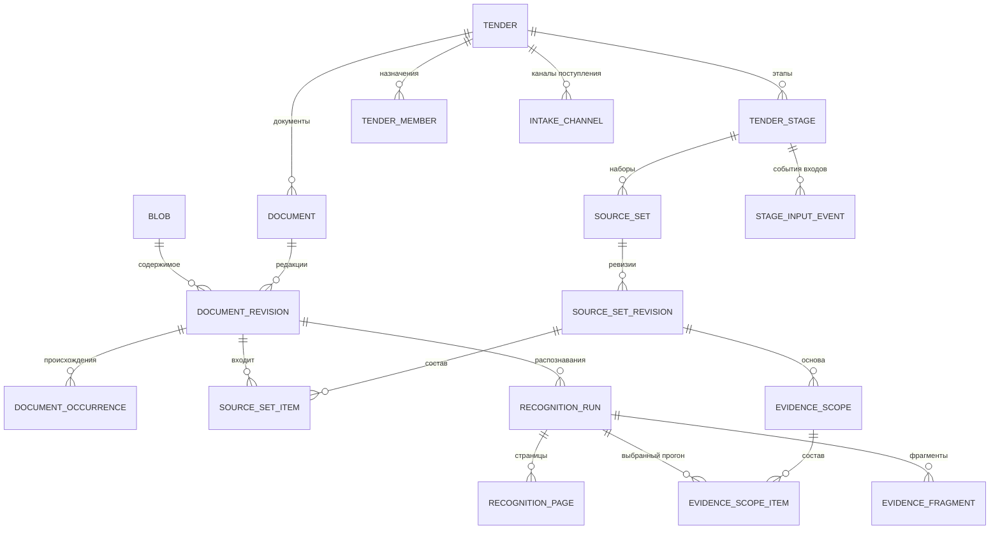
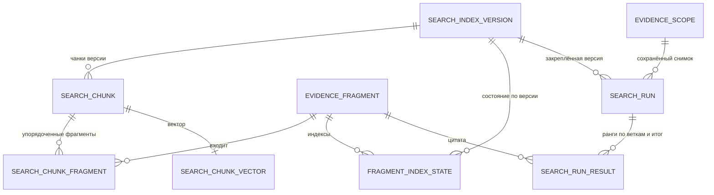
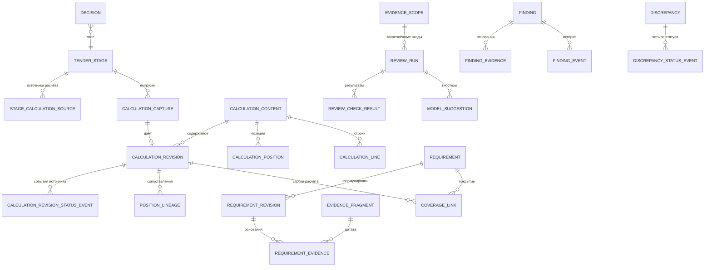
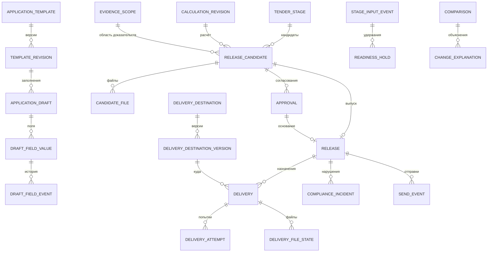
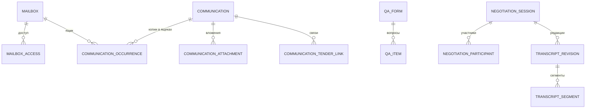

# Контур КП — модель данных

Этап 01. Проект схемы PostgreSQL. DDL пишется на этапе 02 и последующих; имена таблиц и состояний здесь канонические, остальные документы используют их без синонимов.

## 1. Общие правила

- **Ключи.** `id uuid` с `gen_random_uuid()`; внешние идентификаторы хранятся отдельными колонками или в `external_ref`, а не как первичные ключи.
- **Время.** Только `timestamptz`, хранение в UTC. Бизнес-даты без времени (дата цены поставщика) — `date` (ADR-005).
- **Деньги и количества.** Только `numeric` без float; исходная лексема числа из внешнего ответа хранится рядом, если значение участвует в сверке (ADR-005).
- **Изменяемость.** Каждая таблица относится к одному классу:

| Класс | Правило | Как обеспечивается |
|---|---|---|
| `immutable` | Строка после вставки не меняется и не удаляется приложением | Роль приложения не имеет `UPDATE/DELETE`; триггер `forbid_mutation` как вторая линия (ADR-002); оговорка I19 |
| `append-only` | Только новые строки событий; старые не меняются | То же |
| `frozen-after` | Изменяется до перехода в замороженное состояние, затем как `immutable` | Триггер проверяет состояние; переход — отдельная команда |
| `mutable` | Изменяется командами с `row_version` | `row_version bigint`, `If-Match`, аудит в `audit_event` |
| `derived` | Производные данные, можно пересобрать | Не источник истины (индекс, кэш) |

- **Область тендера.** Все данные, относящиеся к тендеру, несут `tender_id` (прямо или через однозначного родителя). Доступ — только через слой данных с `AccessContext` (ADR-006).
- **Происхождение.** Всё, что пришло извне, хранит систему, внешний ID, время получения и хэш исходного ответа или файла.
- **Автор.** Команды человека пишут `actor_user_id`; действия сервисов — `principal_id` сервисной учётной записи и, для MCP, `on_behalf_of_user_id`.

Валюты: `RUB`, `USD`, `EUR`, `CNY` и `UNKNOWN` (D-004). Признак НДС: `included`, `excluded`, `not_applicable`, `unknown`. Вид цены: `cost` (себестоимость), `supplier_quote` (цена поставщика), `commercial` (коммерческая цена), `unknown`.

## 2. Карта контекстов

| Контекст | Таблицы | Владелец данных (источник истины) |
|---|---|---|
| Доступ | `app_user`, `user_role`, `tender_member`, `session`, `api_token`, `mailbox`, `mailbox_access` | Портал |
| Тендеры | `tender`, `tender_stage`, `stage_calculation_source`, `stage_input_event`, `intake_channel`, `intake_file_state`, `external_ref` | Портал; внешние ID — системы-источники |
| Источники | `blob`, `document`, `document_revision`, `document_occurrence`, `import_batch`, `import_item`, `source_set`, `source_set_revision`, `source_set_item`, `evidence_scope`, `evidence_scope_item` | Портал (оригиналы и состав) |
| Договоры | `contract`, `contract_access`, `contract_tender`; владелец-договор у `document` и строк цепочки ниже (§4.14) | Портал (этап 06a; D-017, D-022, D-023) |
| Распознавание и доказательства | `recognition_run`, `recognition_page`, `evidence_fragment` | RDWeb и локальное распознавание (D-014) — обработка; портал — неизменяемая копия доказательств |
| Индекс и поиск | `search_index_version`, `search_chunk`, `search_chunk_fragment`, `search_chunk_vector`, `embedding_cache`, `fragment_index_state`, `search_run`, `search_run_result` | Портал; индекс — производные данные, прогон поиска — журнал (ADR-012, D-013, D-015) |
| Расчёт | `calculation_capture`, `calculation_content`, `calculation_revision`, `calculation_revision_status_event`, `calculation_position`, `calculation_line`, `position_lineage` | TenderHub — расчёт; портал — снимок ревизии |
| Коммуникации | `communication`, `communication_occurrence`, `communication_attachment`, `communication_tender_link`, `qa_form`, `qa_item`, `negotiation_session`, `negotiation_participant`, `transcript_revision`, `transcript_segment` | MailHub и сервис переговоров — первичные данные; портал — связи и копии доказательств |
| Требования и проверки | `requirement`, `requirement_revision`, `requirement_evidence`, `coverage_link`, `review_run`, `review_check_result`, `model_suggestion`, `finding`, `finding_evidence`, `finding_event`, `discrepancy`, `discrepancy_status_event`, `decision`, `question`, `risk_acceptance`, `evidence_dependency` | Портал |
| Приложения | `application_template`, `template_revision`, `approved_wording`, `application_draft`, `draft_field_value`, `draft_field_event` | Портал; реальные формы — владелец процесса |
| Выпуск | `release_candidate`, `candidate_file`, `approval`, `readiness_hold`, `release` | Портал |
| Размещение и отправка | `delivery_destination`, `delivery_destination_version`, `delivery`, `delivery_attempt`, `delivery_file_state`, `send_event`, `compliance_incident` | Портал; хранилища — копии |
| Сравнение | `comparison`, `change_explanation` | Портал |
| Сервисные | `audit_event`, `job`, `resource_slot`, `idempotency_record`, `integration_status`, `sync_cursor`, `setting`, `process_heartbeat` | Портал |

Соответствие сущностям спецификации (§4): Tender → `tender`; TenderStage → `tender_stage`; CalculationRevision → `calculation_revision`; Document / DocumentRevision → `document` / `document_revision`; RecognitionRun / EvidenceFragment → `recognition_run` / `evidence_fragment`; SourceSetRevision → `source_set_revision`; Requirement / CoverageLink → `requirement` / `coverage_link`; Communication / QuestionAnswer / Negotiation → `communication` / `qa_item` / `negotiation_session`; Decision / Discrepancy / Finding → `decision` / `discrepancy` / `finding`; ApplicationTemplate / ApplicationDraft → `application_template` / `application_draft`; ReviewRun → `review_run`; ReleaseCandidate / Approval / Release → `release_candidate` / `approval` / `release`; Delivery / SendEvent → `delivery` / `send_event`; ChangeExplanation → `change_explanation`; AuditEvent / Job → `audit_event` / `job`.

## 3. ER-схемы

### 3.1. Тендер, источники, доказательства

```mermaid
erDiagram
  TENDER ||--o{ TENDER_STAGE : "этапы"
  TENDER ||--o{ TENDER_MEMBER : "назначения"
  TENDER ||--o{ DOCUMENT : "документы"
  DOCUMENT ||--o{ DOCUMENT_REVISION : "редакции"
  BLOB ||--o{ DOCUMENT_REVISION : "содержимое"
  DOCUMENT_REVISION ||--o{ DOCUMENT_OCCURRENCE : "происхождения"
  TENDER_STAGE ||--o{ SOURCE_SET : "наборы"
  SOURCE_SET ||--o{ SOURCE_SET_REVISION : "ревизии"
  SOURCE_SET_REVISION ||--o{ SOURCE_SET_ITEM : "состав"
  DOCUMENT_REVISION ||--o{ SOURCE_SET_ITEM : "входит"
  DOCUMENT_REVISION ||--o{ RECOGNITION_RUN : "распознавания"
  RECOGNITION_RUN ||--o{ RECOGNITION_PAGE : "страницы"
  RECOGNITION_RUN ||--o{ EVIDENCE_FRAGMENT : "фрагменты"
  TENDER_STAGE ||--o{ STAGE_INPUT_EVENT : "события входов"
  TENDER ||--o{ INTAKE_CHANNEL : "каналы поступления"
  SOURCE_SET_REVISION ||--o{ EVIDENCE_SCOPE : "основа"
  EVIDENCE_SCOPE ||--o{ EVIDENCE_SCOPE_ITEM : "состав"
  RECOGNITION_RUN ||--o{ EVIDENCE_SCOPE_ITEM : "выбранный прогон"
```

### 3.1a. Индекс и поиск (этап 05)

```mermaid
erDiagram
  SEARCH_INDEX_VERSION ||--o{ SEARCH_CHUNK : "чанки версии"
  SEARCH_CHUNK ||--o{ SEARCH_CHUNK_FRAGMENT : "упорядоченные фрагменты"
  EVIDENCE_FRAGMENT ||--o{ SEARCH_CHUNK_FRAGMENT : "входит"
  SEARCH_CHUNK ||--o| SEARCH_CHUNK_VECTOR : "вектор"
  SEARCH_INDEX_VERSION ||--o{ FRAGMENT_INDEX_STATE : "состояние по версии"
  EVIDENCE_FRAGMENT ||--o{ FRAGMENT_INDEX_STATE : "индексы"
  SEARCH_INDEX_VERSION ||--o{ SEARCH_RUN : "закреплённая версия"
  EVIDENCE_SCOPE ||--o{ SEARCH_RUN : "сохранённый снимок"
  SEARCH_RUN ||--o{ SEARCH_RUN_RESULT : "ранги по веткам и итог"
  EVIDENCE_FRAGMENT ||--o{ SEARCH_RUN_RESULT : "цитата"
```

### 3.2. Расчёт, требования, проверки

```mermaid
erDiagram
  TENDER_STAGE ||--o{ STAGE_CALCULATION_SOURCE : "источники расчёта"
  TENDER_STAGE ||--o{ CALCULATION_CAPTURE : "выгрузки"
  CALCULATION_CAPTURE ||--o| CALCULATION_REVISION : "даёт"
  CALCULATION_CONTENT ||--o{ CALCULATION_REVISION : "содержимое"
  CALCULATION_REVISION ||--o{ CALCULATION_REVISION_STATUS_EVENT : "события источника"
  CALCULATION_CONTENT ||--o{ CALCULATION_POSITION : "позиции"
  CALCULATION_CONTENT ||--o{ CALCULATION_LINE : "строки"
  CALCULATION_REVISION ||--o{ POSITION_LINEAGE : "сопоставления"
  REQUIREMENT ||--o{ REQUIREMENT_REVISION : "формулировки"
  REQUIREMENT_REVISION ||--o{ REQUIREMENT_EVIDENCE : "основания"
  EVIDENCE_FRAGMENT ||--o{ REQUIREMENT_EVIDENCE : "цитата"
  REQUIREMENT ||--o{ COVERAGE_LINK : "покрытие"
  CALCULATION_REVISION ||--o{ COVERAGE_LINK : "строки расчёта"
  EVIDENCE_SCOPE ||--o{ REVIEW_RUN : "закреплённые входы"
  REVIEW_RUN ||--o{ REVIEW_CHECK_RESULT : "результаты"
  REVIEW_RUN ||--o{ MODEL_SUGGESTION : "гипотезы"
  FINDING ||--o{ FINDING_EVIDENCE : "основания"
  FINDING ||--o{ FINDING_EVENT : "история"
  DISCREPANCY ||--o{ DISCREPANCY_STATUS_EVENT : "четыре статуса"
  DECISION }o--|| TENDER_STAGE : "этап"
```

### 3.3. Приложения, выпуск, размещение, отправка

```mermaid
erDiagram
  APPLICATION_TEMPLATE ||--o{ TEMPLATE_REVISION : "версии"
  TEMPLATE_REVISION ||--o{ APPLICATION_DRAFT : "заполнения"
  APPLICATION_DRAFT ||--o{ DRAFT_FIELD_VALUE : "поля"
  DRAFT_FIELD_VALUE ||--o{ DRAFT_FIELD_EVENT : "история"
  TENDER_STAGE ||--o{ RELEASE_CANDIDATE : "кандидаты"
  RELEASE_CANDIDATE ||--o{ CANDIDATE_FILE : "файлы"
  CALCULATION_REVISION ||--o{ RELEASE_CANDIDATE : "расчёт"
  EVIDENCE_SCOPE ||--o{ RELEASE_CANDIDATE : "область доказательств"
  RELEASE_CANDIDATE ||--o{ APPROVAL : "согласования"
  RELEASE_CANDIDATE ||--o| RELEASE : "выпуск"
  APPROVAL ||--o| RELEASE : "основание"
  STAGE_INPUT_EVENT ||--o{ READINESS_HOLD : "удержания"
  RELEASE ||--o{ DELIVERY : "назначения"
  DELIVERY_DESTINATION ||--o{ DELIVERY_DESTINATION_VERSION : "версии"
  DELIVERY_DESTINATION_VERSION ||--o{ DELIVERY : "куда"
  RELEASE ||--o{ COMPLIANCE_INCIDENT : "нарушения"
  DELIVERY ||--o{ DELIVERY_ATTEMPT : "попытки"
  DELIVERY ||--o{ DELIVERY_FILE_STATE : "файлы"
  RELEASE ||--o{ SEND_EVENT : "отправки"
  COMPARISON ||--o{ CHANGE_EXPLANATION : "объяснения"
```

### 3.4. Коммуникации и переговоры

```mermaid
erDiagram
  MAILBOX ||--o{ MAILBOX_ACCESS : "доступ"
  COMMUNICATION ||--o{ COMMUNICATION_OCCURRENCE : "копии в ящиках"
  MAILBOX ||--o{ COMMUNICATION_OCCURRENCE : "ящик"
  COMMUNICATION ||--o{ COMMUNICATION_ATTACHMENT : "вложения"
  COMMUNICATION ||--o{ COMMUNICATION_TENDER_LINK : "связи"
  QA_FORM ||--o{ QA_ITEM : "вопросы"
  NEGOTIATION_SESSION ||--o{ NEGOTIATION_PARTICIPANT : "участники"
  NEGOTIATION_SESSION ||--o{ TRANSCRIPT_REVISION : "редакции"
  TRANSCRIPT_REVISION ||--o{ TRANSCRIPT_SEGMENT : "сегменты"
```

## 4. Каталог таблиц

Колонки `created_at`, `row_version` и аудиторские поля перечислены только там, где они важны для правила.

### 4.1. Доступ

| Таблица | Класс | Ключевые колонки | Ограничения |
|---|---|---|---|
| `app_user` | mutable | `kind` (`human`/`service`), `service_kind` (`integration`/`model`/`system`, только для service), `login`, `display_name`, `password_hash` (только human), `status` (`active`/`disabled`) | `login` уникален; у service нет пароля |
| `user_role` | mutable | `user_id`, `role` (`admin`/`manager`/`engineer`) | роли только у `human` (триггер) |
| `tender_member` | mutable | `tender_id`, `user_id`, `member_role` (`engineer`/`manager`), `assigned_by`, `assigned_at`, `removed_at`, `removed_by` | активных инженеров на тендер не больше двух (проверка в транзакции назначения и триггер под блокировкой тендера); только активный `human` с той же глобальной ролью; строки не удаляются — снятие через `removed_at` |
| `session` | mutable | `token_hash`, `user_id`, `csrf_hash`, `expires_at`, `revoked_at`, `revoke_reason`, `last_seen_at` | хранится хэш, не токен |
| `api_token` | mutable | `user_id`, `client_kind` (`mcp_codex`/`mcp_cursor`/`other`), `token_hash`, `scopes` (`read`, `propose`), `expires_at`, `revoked_at` | нет областей `approve`/`release`/`send`/`admin` на уровне схемы (CHECK) |
| `mailbox` | mutable | `system` (`mailhub`), `external_account_id`, `address` | (`system`, `external_account_id`) уникальны |
| `mailbox_access` | mutable | `mailbox_id`, `user_id`, `source` (`manual`/`mailhub_sync`), `granted_by`, `revoked_at` | один активный доступ на пару |

### 4.2. Тендеры

| Таблица | Класс | Ключевые колонки | Ограничения |
|---|---|---|---|
| `tender` | mutable | `code`, `title`, `customer_name`, `object_name`, `status` (`active`/`archived`) | `code` уникален |
| `tender_stage` | mutable | `tender_id`, `seq`, `title`, `submission_deadline`, `status` (`active`/`archived`), `kp_total_rule`, `input_version` | (`tender_id`, `seq`) уникальны. Готовность, согласование, выпуск и отправка не хранятся в статусе этапа, а выводятся из событий (I01). `input_version` — монотонный счётчик барьера актуальности (`state-machines.md` §1.1); меняется только вместе со вставкой `stage_input_event` |
| `stage_calculation_source` | mutable | `stage_id`, `tender_id`, `system` (`tenderhub`), `external_tender_id` (uuid строки тендера TenderHub), `external_version` (заявленная при связывании), `role` (`primary`/`reference`), `created_by`, `row_version` | один `primary` на этап (частичный уникальный индекс); (`stage_id`, `system`, `external_tender_id`) уникальны; этап, тендер и внешний id связи неизменны, связь не удаляется — прежняя основная связь при смене становится `reference` (этап 06, миграция 0011). Тот же тендер TenderHub может быть связан с несколькими этапами: поддерживаются обе схемы «этап ↔ версия», пока нет ответа на Q-03 |
| `stage_input_event` | append-only | `stage_id`, `seq` (= новое `input_version`), `event_class` (`source`/`calculation`/`content`), `event_type` (`import_accepted`/`document_revision_registered`/`communication_linked`/`transcript_revision_added`/`qa_form_added`/`calculation_revision_added`/`decision_recorded`/`draft_field_changed`/`source_set_changed`/`recognition_run_completed`), `ref_type`, `ref_id`, `actor` | (`stage_id`, `seq`) уникальны; вставляется в той же транзакции, что и изменение, под блокировкой строки этапа (R01-03); решения по удержаниям и прочие действия из `state-machines.md` §1.1 событий не порождают (R01-07) |
| `intake_channel` | mutable | `tender_id`, `kind` (`watched_folder`/`mail_sync`/`negotiation_sync`), `origin` (`local`/`yandex_disk`/`smb`), `locator`, `active`, `freshness_window`, `scan_interval_seconds`, `last_scan_started_at`, `last_successful_scan_at`, `last_error_code`, `pending_unstable`, `disabled_reason` | отключение канала — команда руководителя с причиной и аудитом; успешный скан — полный проход без файлов, ожидающих стабильности |
| `intake_file_state` | derived | `channel_id`, `rel_path`, `size_bytes`, `mtime_ms`, `unchanged_since`, `imported_size`, `imported_mtime`, `imported_sha256`, `missing_since` | состояние файлов наблюдаемой папки между сканами (стабильность, повторное обнаружение); источник истины — редакции и происхождения (этап 03) |
| `external_ref` | immutable | `entity_type`, `entity_id`, `tender_id`, `system`, `external_id`, `external_version`, `observed_at` | (`system`, `external_id`, `external_version`, `entity_type`) уникальны, `NULL` версии считается значением (`NULLS NOT DISTINCT`). Этап 06: `entity_type = 'tender'`, `entity_id = tender_id`, `external_id` — номер тендера TenderHub (`tender_number`, общий для всех его версий: каждая версия там — отдельная строка со своим uuid); первая успешная выгрузка закрепляет номер за тендером портала, выгрузка тендера с тем же номером в другой тендер портала отклоняется (`external_identity_conflict`) |

### 4.3. Источники

| Таблица | Класс | Ключевые колонки | Ограничения |
|---|---|---|---|
| `blob` | immutable | `sha256` (PK), `size_bytes`, `media_type`, `storage_key`, `verified_at` | файл в хранилище с тем же хэшем (ADR-003) |
| `document` | mutable | `tender_id`, `title`, `name_key` (ключ группировки по имени файла, этап 03), `doc_type` (`tz`/`pd`/`rd`/`contract`/`boq`/`qa_form`/`letter`/`minutes`/`supplier_quote`/`other`), `doc_code`, `scope_note` | метаданные с `row_version`; логическая группировка подтверждается инженером |
| `document_revision` | immutable | `document_id`, `tender_id`, `blob_sha256`, `revision_seq`, `revision_label`, `issued_at`, `received_at`, `supersedes_revision_id`, `registered_by` | (`document_id`, `blob_sha256`) и (`tender_id`, `blob_sha256`) уникальны: одно содержимое в тендере — одна редакция; повторное получение — происхождение (A13, A14) |
| `document_occurrence` | append-only | `document_revision_id`, `source_kind` (`upload`/`watched_folder`/`archive_member`/`yandex_disk`/`smb`/`mail_attachment`/`rdweb_export`), `source_locator`, `observed_name`, `observed_at`, `import_item_id` | путь — история происхождения, не идентичность |
| `import_batch` | frozen-after | `tender_id`, `stage_id`, `source_kind` (`upload`/`watched_folder`), `intake_channel_id`, `status` (`running`/`completed`/`completed_with_errors`/`failed`), `upload_name`, `upload_blob_sha256`, `expanded_at`, `failure_code` | замораживается при завершении (триггер); завершается только после `expanded_at` — состав партии известен; идемпотентность загрузки — `idempotency_record` команды |
| `import_item` | frozen-after | `batch_id`, `member_path`, `status` (`pending`/`skipped_partial`/`rejected`/`registered`/`duplicate`), `reject_reason` (`path_traversal`/`size_limit`/`type_not_allowed`/`unstable_file`/`corrupt`), `blob_sha256`, `document_revision_id` (для `registered` и `duplicate`), `resolution` (`none`/`reimported`/`not_applicable`), `resolved_by_item_id`, `resolution_decision_id` | отказ — строка со статусом, а не пропажа файла; статус после завершения партии не меняется, меняется только исход (`resolution`) командой с аудитом; технический отказ не означает неприменимость (R01-09, `state-machines.md` §3.1) |
| `source_set` | mutable | `stage_id`, `purpose` (`working`/`review`/`release`) | — |
| `source_set_revision` | frozen-after | `source_set_id`, `seq`, `status` (`draft`/`frozen`), `base_revision_id`, `frozen_at`, `frozen_by`, `content_hash` | после `frozen` состав и хэш не меняются |
| `source_set_item` | frozen-after | `source_set_revision_id`, `document_revision_id`, `inclusion` (`included`/`excluded_not_applicable`/`inherited`), `decided_by`, `reason` | (`source_set_revision_id`, `document_revision_id`) уникальны; меняется только пока ревизия `draft` |
| `evidence_scope` | immutable | `stage_id`, `tender_id`, `source_set_revision_id`, `input_version` (для аудита), `content_hash`, `created_by`, `created_at`, `created_xact` | снимок области доказательств (R01-01), реализован на этапе 05 (миграция 0009): основа — замороженная ревизия набора этого этапа (триггер); создаётся до начала проверки и больше не меняется; одинаковый состав даёт тот же `content_hash` и ту же строку (уникальность (`stage_id`, `content_hash`)). Номер версии снимка актуальность не подтверждает: покрытие событий проверяется по составу (`state-machines.md` §1.1). Состав фиксируется транзакцией создания (миграция 0010, R05-01): `created_xact` (`xid8`) и `created_at` ставит триггер — номер и время начала этой транзакции; при `COMMIT` отложенная проверка сверяет полноту и `content_hash` с фактическим составом, неполный или несогласованный снимок не фиксируется |
| `evidence_scope_item` | immutable | `scope_id`, `unit_type` (`document_recognition`/`communication`/`transcript_revision`; этап 05 — только `document_recognition`, письма и транскрипции добавляет этап 07), `document_revision_id`, `recognition_run_id` (для `document_recognition`; `null` явно означает «только оригинал без распознавания»), `communication_id`, `transcript_revision_id`, `inclusion_reason` | типизированные ссылки; каждая единица источника входит в снимок не более одного раза. Вставка — только в транзакции, создавшей снимок (печать `created_xact` и `created_at`), в любой другой — отказ `55000` и для владельца таблиц (миграция 0010, R05-01). Весь состав пишется одной командой: после каждой команды вставки БД сверяет полноту (каждая включённая редакция основы — единица снимка) и хэш состава с `content_hash` снимка |

Владелец документа и редакции — ровно один: тендер (`tender_id`) или договор (`contract_id`), этап 06a (D-023, §4.14). Для редакций договора `document_occurrence` не пишется: провенанс загрузки — в журнале аудита, экспорта RDWeb — в самом прогоне.

### 4.4. Распознавание и доказательства

| Таблица | Класс | Ключевые колонки | Ограничения |
|---|---|---|---|
| `recognition_run` | frozen-after | `document_revision_id`, `tender_id`, `engine` (`rdweb_export`/`rdweb_api`/`text_layer`/`local_ocr`), `engine_schema_version`, `source_artifact_sha256`, `source_artifact_name`, `status` (`queued`/`running`/`complete`/`partial`/`failed`/`cancelled`), `pages_total`, `pages_recognized`, `quality`, `failure_code`, `failure_detail`, `supersedes_run_id`, `row_version` | после финального статуса неизменна; новый OCR — новая строка (A10). Пара (`document_revision_id`, `source_artifact_sha256`) уникальна среди прогонов, не завершившихся отказом или отменой: один архив — один прогон, после `failed` и `cancelled` повтор разрешён. `complete` невозможен, пока `pages_recognized < pages_total` (CHECK, I18); переход в `complete`/`partial` дополнительно сверяет счётчики с фактическими строками `recognition_page` (триггер, R04-04) |
| `recognition_page` | immutable | `run_id`, `page_index`, `page_label`, `sheet_label`, `width_px`, `height_px`, `rotation`, `status` (`recognized`/`missing`/`failed`) | (`run_id`, `page_index`) уникальны; вставка только в выполняющийся прогон (триггер, R04-04) |
| `evidence_fragment` | immutable | `tender_id`, `source_unit_type` (`recognition_run`/`communication`/`transcript_revision`), `source_unit_id`, `run_id` или `transcript_segment_id` или `communication_id`, `document_revision_id`, `origin` (см. ниже), `fragment_kind`, `fragment_key`, `external_block_id`, `ordinal`, `page_index`, `bbox_norm numeric[4]`, `bbox_space`, `shape_type`, `polygon_norm`, `rotation`, `text`, `text_sha256`, `derived_model_ref`, `external_crop_url`, `warnings`, `part_index`, `part_total` | ID портала стабилен; текст не редактируется; единица источника — основа фильтра области (ADR-008). Вставка только в выполняющийся прогон (триггер, R04-04). Составной FK (`run_id`, `document_revision_id`, `tender_id`) на прогон: редакция доказательства — это редакция его прогона (R04-05) |
| `fragment_index_state` | derived | описана в §4.13 | **не создана на этапе 04**: до этапа 05 у неё нет ни писателя, ни читателя — заводится вместе с индексацией |

#### Реализация (этап 04)

Миграция `docs/migrations/0005_recognition_evidence.sql` создаёт `recognition_run`, `recognition_page` и `evidence_fragment`. Против эскиза этапа 01 добавлены две колонки `evidence_fragment`, обе — следствие того, что формат экспорта подтверждён одним образцом:

- `fragment_key` — детерминированный ключ идемпотентности разбора (`block:<id>:text`, `block:<id>:summary`, `stamp:p07:1`). Нужен потому, что у части фрагментов внешнего `block_id` нет: штампы приходят строками `**Stamp:**` в `_results.md`, а не отдельными секциями. Уникален в паре (`run_id`, `fragment_key`) — повторный разбор того же архива не двоит фрагменты.
- `bbox_space` (`page_unrotated` / `page_rotated`) — в каком пространстве заданы координаты. Эскиз этапа 01 обещал «`bbox_norm` в координатах страницы без поворота», но PDF-парсера в портале нет, и доказать пространство экспорта нечем. Координаты сохраняются как есть, пространство фиксируется явно (для `rdweb_export` — `page_rotated`), а пересчёт делает браузер (`apps/web/src/utils/bbox.ts`). Неверно нанесённая рамка хуже её отсутствия (I18).

Служебные: `shape_type`/`polygon_norm` (в образце 3 блока-многоугольника), `external_crop_url` (ссылка экспорта, хранится текстом и не загружается — A38), `warnings` (пометки разбора конкретного фрагмента), `tender_id` с составными внешними ключами на (`id`, `tender_id`) редакции и прогона — вторая линия области видимости.

#### Поправки после ревью 04-1 (миграция 0006)

- `recognition_run.status` получил терминальное значение `cancelled`: отмена задания обязана терминализовать прогон, иначе он навсегда остаётся активным без задания, блокирует заморозку состава и держит пару «редакция + архив» (R04-02).
- `recognition_page` и `evidence_fragment` получили охранник `BEFORE INSERT`: дочернюю строку принимает только прогон в состоянии `running`, причём строка прогона блокируется — вставка сериализуется с финальной транзакцией worker, и после терминализации новое доказательство появиться не может (R04-04, I15).
- `evidence_fragment` получил составной внешний ключ (`run_id`, `document_revision_id`, `tender_id`) на `recognition_run (id, document_revision_id, tender_id)` и условие `run_id IS NULL OR document_revision_id IS NOT NULL`. Простого FK на `document_revision (id)` было мало: строка могла ссылаться на редакцию чужого тендера при корректных `run_id` и `tender_id` (R04-05, I17).
- `evidence_fragment.part_index`/`part_total` — длинный текст блока сохраняется несколькими неизменяемыми фрагментами со стабильными ключами `<ключ>#pN` вместо усечения; индекс `evidence_fragment_page_idx` и курсор чтения включают `part_index`, поэтому порядок частей определён (R04-06).

#### Поправки после ревью 04-2 (миграция 0007)

- Терминализация прогона требует не только совпадения счётчиков, но и точного набора номеров страниц `0..pages_total-1`: одной страницы с номером 999 при `pages_total = 1` больше недостаточно, чтобы объявить полноту (R04-10, I18).
- `evidence_fragment (run_id, page_index)` — внешний ключ на `recognition_page (run_id, page_index)`. Доказательство не может ссылаться на страницу, которой в прогоне нет; фрагмент без страницы (`page_index IS NULL`) по-прежнему штатен — так сохраняются секции без блока и непривязанные штампы (R04-10).
- Частичный уникальный индекс `recognition_run_active_key` на `document_revision_id` со статусами `queued`/`running`: на редакции допустим один незавершённый прогон. Иначе два архива, принятые подряд, становятся братьями с общим `supersedes_run_id`, и история версий распознавания перестаёт быть цепочкой (R04-12, A10).

#### Поправки после ревью 04-3 (миграция 0008)

Одной дисциплины API для линейности истории мало: роль `kontur_app` имеет прямой INSERT в `recognition_run`, а охранник 0005 проверял только завершённость предшественника. Оставалось возможным вставить второго потомка тому же предку и начать вторую ветку «с нуля» при уже существующей истории.

- Частичный уникальный индекс `recognition_run_supersedes_key`: у предшественника ровно один потомок. Отказавшая и отменённая попытка места потомка не занимает (предикат тот же, что у `recognition_run_artifact_key`) — иначе один сбой закрывал бы редакцию навсегда.
- Охранник вставки дополнен: `supersedes_run_id IS NULL` допустим только пока у редакции нет завершённого прогона (один корень); предшественник обязан быть хвостом цепочки.
- Охранник берёт ту же advisory-блокировку по редакции, что и приём архива в API, поэтому проверка «хвост свободен» не разъезжается со вставкой.

Значения `evidence_fragment.origin` (I06): `document_text` (текстовый слой или текст документа), `recognized_text` (RDWeb/OCR), `model_description` (описание, summary, verification модели), `negotiation_speech` (реплика транскрипции), `negotiation_hint` (подсказка сервиса переговоров), `email_body`, `attachment_text`. Решение человека фрагментом не является и хранится в `decision`.

Политика индексации по `origin` (ADR-012 §21–22, AR05-04): в индекс поиска попадают только `document_text` и `recognized_text` (с этапа 07 — `email_body`, `attachment_text`, `negotiation_speech`). `model_description` и `negotiation_hint` не индексируются и не могут стать результатом поиска или единственной цитатой.

### 4.5. Расчёт

| Таблица | Класс | Ключевые колонки | Ограничения |
|---|---|---|---|
| `calculation_capture` | frozen-after | `stage_id`, `tender_id`, `source_id` (связь этапа), `system`, `external_tender_id`, `capture_kind` (`portal_capture`/`tenderhub_revision`), `transport` (`api`; `db` — после D-016), `trigger` (`manual`/`deadline`), `deadline_basis`, `requested_by`, `status` (`capturing`/`complete`/`inconsistent`/`failed`), `attempts` (журнал попыток), `consistency` (до/после: `updated_at`, итог, курсы, число позиций и строк; причины расхождения; сверка агрегатов), `source_observed` (номер, версия, срок подачи источника), `raw_bundle_sha256`, `contract_version`, `content_id`, `revision_id`, `failure_code`, `failure_detail`, `job_id`, `finished_at`, `row_version` | сырые ответы и манифест выгрузки в `blob`; не более одной `capturing`-выгрузки на (`stage_id`, `external_tender_id`); после выхода из `capturing` строка неизменна, `attempts` только дописывается; `complete` требует результата, связанного с **последней** ревизией того же тендера TenderHub с тем же содержимым; `failed`/`inconsistent` — только с кодом причины и без результата (этап 06). Идемпотентность запроса — `Idempotency-Key` команды и `dedupe_key` задания, отдельной колонки нет |
| `calculation_content` | immutable | `content_hash`, `normalization_version`, `source_grand_total` (`cached_grand_total` источника), `usd_rate`, `eur_rate`, `cny_rate`, `kp_total`, `kp_total_currency`, `kp_total_rule`, `kp_total_semantics` (правило итога и его источник; до Q-05 — `rule_not_set` и перечень недоступных составляющих), `raw_lexemes` (исходные лексемы чисел шапки), `positions_count`, `lines_count` | дедупликация только содержимого: `content_hash` уникален и покрывает позиции, строки, итог источника, итог КП с валютой и правилом и курсы (R01-04). `kp_total` без правила непредставим (CHECK). Хэш пересчитывает БД по фактическому составу; позиции и строки вставляются только транзакцией создания содержимого, после неё состав закрыт (миграция 0011, по образцу R05-01) |
| `calculation_revision` | immutable | `stage_id`, `tender_id`, `content_id`, `capture_id`, `seq`, `kind` (`provisional`/`verified`), `system`, `external_tender_id`, `external_revision_ref` (после X-01), `supersedes_revision_id` | идентичность наблюдения источника, отдельная от содержимого: (`stage_id`, `seq`) уникальны, `seq` — следующий; `verified` ⇔ есть `external_revision_ref` (CHECK), `verified` уникальна по (`stage_id`, `external_revision_ref`); `supersedes_revision_id` — последняя ревизия того же тендера TenderHub на этапе; повтор выгрузки идемпотентен только относительно **последней** ревизии этапа для того же тендера TenderHub — возврат A → B → A создаёт новую ревизию со ссылкой на прежнее содержимое (R01-08); `verified` с тем же содержимым — новая строка, `provisional` не меняется (A07). Вид ревизии соответствует виду выгрузки (`portal_capture` → `provisional`, `tenderhub_revision` → `verified`) |
| `calculation_revision_status_event` | append-only | `revision_id`, `seq`, `status` (`closed_at_source`/`reopened_at_source`/`superseded_at_source`), `observed_at`, `source_raw_sha256` | факт закрытия и изменения статуса у источника пишется событием, прежние записи не меняются; события бывают только у `verified`-ревизии (X-01); `seq` — следующий; повтор того же статуса подряд, переоткрытие без закрытия и любое событие после `superseded_at_source` отклоняются БД |
| `calculation_position` | immutable | `content_id`, `external_position_id`, `position_number`, `item_no`, `work_name`, `unit_code`, `volume`, `manual_volume`, `manual_note`, `client_note`, `section_number`, `position_name`, `is_section`, `is_additional`, `hierarchy_level`, `parent_external_position_id`, `cost_category_name` (самая частая категория строк у источника; строкам не присваивается), суммы позиции (`total_material`, `total_works`, `*_cost_per_unit`, `total_commercial_*`, `base_total`, `commercial_total`, `material_cost_total`, `work_cost_total`), `markup_percentage`, `items_count`, `raw_lexemes` | (`content_id`, `external_position_id`) уникальны; `is_section` — заголовок раздела, работой не считается; `manual_volume` — значение источника без подтверждённой семантики |
| `calculation_line` | immutable | `content_id`, `external_item_id`, `external_position_id`, `sort_number`, `item_type`, `material_type`, `description`, `work_name`, `material_name`, `unit_code`, `quantity`, `base_quantity`, `consumption_coefficient`, `conversion_coefficient`, `unit_rate`, `currency`, `delivery_price_type`, `delivery_amount`, `total_amount` (вид `cost`), `commercial_markup`, `total_commercial_material`, `total_commercial_work` (вид `commercial`), `quote_link`, `quote_price_date`, `quote_valid_until`, `cost_category`, `detail_cost_category`, `detail_cost_location`, `work_name_id`, `material_name_id`, `detail_cost_category_id`, `parent_work_external_item_id` (комплексная строка материала к работе), `raw_lexemes` | (`content_id`, `external_item_id`) уникальны; строка ссылается на позицию того же содержимого (FK (`content_id`, `external_position_id`)); `currency` — только `RUB`/`USD`/`EUR`/`CNY`, иначе выгрузка отклоняется как `CONTRACT_MISMATCH`; даты цены маршрут не отдаёт — `NULL` |
| `position_lineage` | append-only | `seq`, `tender_id`, `from_revision_id`, `from_external_position_id`, `to_revision_id`, `to_external_position_id`, `method` (`source_lineage`/`exact_key`/`manual`), `confidence`, `status` (`proposed`/`confirmed`/`rejected`), `decided_by` | разделение и слияние — несколько строк (A22); ревизии — разные и одного тендера; позиции существуют в содержимом своих ревизий (триггер); `decided_by` есть ровно у решённых записей; `manual` — только решение человека. Этап 06 — хранение и API решений человека; автоматическое сопоставление — этап 10 |

**Реализация (этап 06), отличия от проекта этапа 01.** `calculation_content.component_totals` отдельной колонкой не заведён: составляющие, которые TenderHub отдаёт по ключу, хранятся на уровне позиций и строк (себестоимость, коммерческая стоимость материалов и работ, наценка), `cached_grand_total` — в `source_grand_total`; страхование, снижение и перераспределение API не отдаёт — они перечислены в `kp_total_semantics.unavailableComponents` (Q-05). `fx_rates` хранится колонками `usd_rate`/`eur_rate`/`cny_rate` **без даты**: TenderHub отдаёт курсы тендера без даты, дата не выдумывается (в API `asOf: null`). Колонка `idempotency_key` у выгрузки не нужна: повтор запроса гасит `idempotency_record` команды, повтор задания — `dedupe_key`.

### 4.6. Коммуникации и переговоры

| Таблица | Класс | Ключевые колонки | Ограничения |
|---|---|---|---|
| `communication` | immutable | `kind` (`email`), `message_id_header`, `dedupe_key`, `subject`, `sent_at`, `direction` (`inbound`/`outbound`/`unknown`), `from_address`, `participants`, `in_reply_to`, `references`, `body_origin_sha256` | `dedupe_key` уникален: одно логическое письмо (A34) |
| `communication_occurrence` | append-only | `communication_id`, `mailbox_id`, `external_item_id`, `folder`, `source` (`mailhub_api`/`eml_import`), `observed_at` | видимость письма — через доступ к ящику хотя бы одного вхождения (A35) |
| `communication_attachment` | immutable | `communication_id`, `blob_sha256`, `filename`, `external_attachment_id`, `document_revision_id` | доступ как у письма |
| `communication_tender_link` | append-only | `communication_id`, `tender_id`, `stage_id`, `status` (`suggested`/`confirmed`/`rejected`), `decided_by` | автоматическая связь только `suggested` |
| `qa_form` | immutable | `tender_id`, `document_revision_id`, `form_revision_label` | новая редакция формы — новая строка |
| `qa_item` | immutable | `qa_form_id`, `question_no`, `question_fragment_id`, `answer_fragment_id`, `answer_state` (`empty`/`answered`/`replaced`), `replaces_item_id` | (`qa_form_id`, `question_no`) уникальны |
| `negotiation_session` | immutable | `tender_id`, `external_session_id`, `started_at`, `source` (`manifest_import`/`service_api`), `audio_ref`, `audio_sha256` | — |
| `negotiation_participant` | immutable | `session_id`, `speaker_label`, `name`, `side` (`customer`/`contractor`/`unknown`) | — |
| `transcript_revision` | immutable | `session_id`, `seq`, `source_artifact_sha256`, `supersedes_revision_id` | исправление транскрипции — новая редакция |
| `transcript_segment` | immutable | `revision_id`, `segment_no`, `speaker_label`, `t_start_ms`, `t_end_ms`, `segment_kind` (`speech`/`hint`), `text` | подсказка — отдельный вид, не речь (A03) |

### 4.7. Требования, проверки, решения

| Таблица | Класс | Ключевые колонки | Ограничения |
|---|---|---|---|
| `requirement` | mutable | `tender_id`, `stage_id`, `code`, `current_revision_id`, `status` (`candidate`/`confirmed`/`rejected`/`superseded`) | переход статуса — командой с `row_version` |
| `requirement_revision` | immutable | `requirement_id`, `seq`, `statement`, `parameters`, `scope` (объект, секция, этаж, помещение), `origin` (`human`/`model_suggestion`), `model_suggestion_id`, `authored_by` | правка формулировки — новая ревизия, цитаты сохраняются |
| `requirement_evidence` | immutable | `requirement_revision_id`, `fragment_id`, `role` (`basis`/`context`) | фрагмент должен входить в область этапа |
| `coverage_link` | mutable | `requirement_id`, `calculation_revision_id`, `external_position_id`, `external_item_id`, `kind` (`explicit_line`/`complex_rate`/`assumption`), `status` (`proposed`/`confirmed`/`rejected`/`stale`), `decided_by` | many-to-many (A05) |
| `review_run` | frozen-after | `stage_id`, `evidence_scope_id`, `calculation_revision_id`, `rules_version`, `model_config`, `status` (`queued`/`running`/`completed`/`completed_with_gaps`/`failed`), `coverage` (документы, страницы, распознано, ошибки) | входы закреплены снимком `evidence_scope`, созданным до начала проверки; результат после финала неизменен (I18, R01-01) |
| `review_check_result` | immutable | `run_id`, `check_code`, `outcome` (`passed`/`failed`/`not_applicable`/`incomplete`/`error`), `details`, `evidence_refs` | `incomplete` не считается `passed` |
| `model_suggestion` | frozen-after | `run_id`, `suggestion_kind` (`requirement_candidate`/`discrepancy_hypothesis`/`change_reason`/`field_value`/`question_draft`/`finding_proposal`), `payload`, `cited_fragment_ids`, `model_ref`, `prompt_hash`, `input_scope_hash`, `status` (`open`/`accepted`/`rejected`/`expired`), `request_id`, `created_by_principal`, `decided_by` | (`created_by_principal`, `request_id`) уникальны (A37); принять может только human |
| `finding` | mutable | `tender_id`, `stage_id`, `finding_kind`, `title`, `severity` (`critical`/`major`/`minor`), `confidence` (`low`/`medium`/`high`), `status` (`open`/`in_progress`/`resolved`/`accepted_risk`/`rejected`/`stale`), `owner_user_id`, `action`, `impact` (сумма с основанием или «не рассчитано»), `origin` (`rule`/`model_suggestion`/`human`) | критичность и уверенность — разные поля |
| `finding_evidence` | immutable | `finding_id`, `side` (`left`/`right`/`context`), `fragment_id` или ссылка на строку расчёта или поле приложения | — |
| `finding_event` | append-only | `finding_id`, `from_status`, `to_status`, `reason`, `actor_user_id` | история решений |
| `discrepancy` | mutable | `tender_id`, `stage_id`, `topic`, `finding_id`, текущие значения четырёх статусов | четыре оси I09 независимы |
| `discrepancy_status_event` | append-only | `discrepancy_id`, `axis` (`customer_position`/`calculation`/`proposal`/`documents`), `value`, `basis_fragment_ids`, `actor_user_id` | значения осей — §4.7.1 |
| `decision` | immutable | `tender_id`, `stage_id`, `subject_type`, `subject_id`, `decision_type`, `statement`, `rationale`, `basis_fragment_ids`, `decided_by` (только human), `supersedes_decision_id` | новое решение заменяет, старое остаётся; `decision_type = input_event_disposition` — решение по удержанию, `import_item_disposition` — решение по элементу импорта; ни то ни другое событий барьера не порождает (R01-07, R01-09) |
| `question` | mutable | `tender_id`, `stage_id`, `text`, `status` (`draft`/`sent`/`answered`/`closed`), `qa_item_id`, `origin` | — |
| `risk_acceptance` | immutable | `stage_id`, `candidate_id`, `blocker_code`, `reason`, `accepted_by` (manager), `accepted_at` | только для бизнес-блокеров (§5 state-machines) |
| `evidence_dependency` | append-only | `dependent_type`, `dependent_id`, `depends_on_type` (`document_revision`/`fragment`/`calculation_revision`/`decision`), `depends_on_id` | основа инвалидации (stale) |

#### 4.7.1. Оси статусов разногласия (I08, I09)

| Ось | Значения |
|---|---|
| `customer_position` | `unknown`, `proposed_by_contractor`, `discussed_orally`, `agreed_in_writing`, `rejected_by_customer` |
| `calculation` | `not_reflected`, `partially_reflected`, `reflected`, `not_applicable` |
| `proposal` | `not_reflected`, `reflected`, `not_applicable` |
| `documents` | `not_fixed`, `fixed_in_tz`, `fixed_in_contract`, `not_applicable` |

`discussed_orally` не равно `agreed_in_writing`: устная реплика или подсказка переговоров не переводит ось в согласие (A03).

### 4.8. Приложения

| Таблица | Класс | Ключевые колонки | Ограничения |
|---|---|---|---|
| `application_template` | mutable | `owner_kind` (`company`/`customer`), `tender_id` (для формы заказчика), `name` | — |
| `template_revision` | frozen-after | `template_id`, `seq`, `source_blob_sha256`, `field_schema`, `status` (`draft`/`approved`), `approved_by`, `is_demo` | демо-шаблон помечен и не допускается к production-выпуску |
| `approved_wording` | immutable | `text`, `tags`, `approved_by`, `supersedes_id` | библиотека утверждённых формулировок |
| `application_draft` | mutable | `stage_id`, `template_revision_id`, `status` (`in_progress`/`complete`) | — |
| `draft_field_value` | mutable | `draft_id`, `field_key`, `value`, `value_origin` (`approved_wording`/`model_suggestion`/`manual`/`decision`), `basis_refs`, `status` (`empty`/`suggested`/`accepted`/`edited`/`needs_discussion`/`stale`) | ручной текст не стирается при `stale` |
| `draft_field_event` | append-only | `field_value_id`, `from_status`, `to_status`, `old_value`, `new_value`, `actor_user_id` или `principal_id` | история правок (A09) |

### 4.9. Выпуск

| Таблица | Класс | Ключевые колонки | Ограничения |
|---|---|---|---|
| `release_candidate` | frozen-after | `stage_id`, `seq`, `mode` (`production`/`test`), `status` (`assembling`/`assembly_failed`/`ready_for_approval`/`approved`/`returned`/`superseded`/`released`), `calculation_revision_id`, `evidence_scope_id`, `review_run_ids`, `decision_set_hash`, `template_revision_ids`, `calculation_baseline_version`, `content_baseline_version`, `manifest_sha256`, `content_hash` | `mode` задаётся при создании и не меняется (R01-05); все `review_run_ids` построены на том же `evidence_scope_id` и той же ревизии расчёта; покрытие событий источников определяется составом снимка, числовые базы — закреплённой ревизией расчёта и транзакцией создания кандидата (R01-03, `state-machines.md` §1.1); содержимое неизменно с `ready_for_approval` |
| `candidate_file` | immutable | `candidate_id`, `path`, `blob_sha256`, `size_bytes`, `audience` (`customer`/`internal`), `media_type` | (`candidate_id`, `path`) уникальны |
| `approval` | frozen-after | `candidate_id`, `candidate_content_hash`, `input_version` (версия этапа в момент согласования, для аудита), `approved_by`, `approved_at`, `comment`, `status` (`active`/`revoked`/`superseded`), `revoked_by`, `revoked_at` | частичный уникальный индекс: одно `active` на кандидата; `approved_by` — human с ролью manager в тендере (триггер) |
| `readiness_hold` | frozen-after | `stage_id`, `candidate_id`, `input_event_id`, `status` (`open`/`resolved_not_applicable`/`resolved_requires_new_candidate`), `decision_id`, `resolved_by` | (`candidate_id`, `input_event_id`) уникальны; создаётся синхронно в транзакции события входов для активного кандидата. Барьер актуальности опирается на события, а не на наличие строк удержаний (I04, R01-03) |
| `release` | immutable | `candidate_id` (уникален), `approval_id`, `mode` (= `release_candidate.mode`), `input_version`, `released_by`, `released_at`, `manifest_sha256`, `content_hash` | один выпуск на кандидата (A26); `content_hash` = `approval.candidate_content_hash`; `released_by` — назначенный инженер-human (триггер) |

### 4.10. Размещение и отправка

| Таблица | Класс | Ключевые колонки | Ограничения |
|---|---|---|---|
| `delivery_destination` | mutable | `kind` (`yandex_disk`/`smb`), `environment` (`test`/`production`), `active`, `current_version_id` | `environment` не меняется после создания (триггер); секреты не в БД (ADR-006) |
| `delivery_destination_version` | immutable | `destination_id`, `version`, `root_locator`, `include_internal`, `created_by`, `created_at` | изменение корня или политики — новая версия; существующие доставки её не видят (R01-05) |
| `delivery` | mutable | `release_id`, `destination_version_id`, `environment` (копия из назначения), `status` (§16 state-machines), `attempt_count`, `last_error_code`, `row_version` | (`release_id`, `destination_version_id`) уникальны; назначения независимы (A28); все попытки используют закреплённую версию; `environment` равна `release.mode` (проверка при создании) |
| `delivery_attempt` | append-only | `delivery_id`, `seq`, `started_at`, `finished_at`, `outcome`, `error_code` | — |
| `delivery_file_state` | mutable | `delivery_id`, `path`, `blob_sha256`, `remote_state` (`absent`/`staged`/`committed`/`verified`/`conflict`/`unknown`), `remote_fingerprint`, `checked_at` | перезапись файла с другим хэшем запрещена (A30) |
| `send_event` | frozen-after | `release_id` (только выпуск с `mode = production`), `channel` (`email`/`customer_portal`/`paper`/`other`), `sent_at`, `recipients`, `evidence_kind` (`mailhub_message`/`uploaded_file`/`manual_note`), `evidence_ref`, `attachment_check` (`matched`/`mismatched`/`not_checked`), `status` (`registered`/`verified`/`disputed`), `registered_by`, `idempotency_key` | (`registered_by`, `idempotency_key`) уникальны; письмо не доказывает получение (A46); для тестового выпуска запись невозможна (R01-05) |
| `compliance_incident` | append-only | `release_id`, `incident_kind` (`test_release_sent_externally`/`sent_despite_blocker`/`other`), `evidence_ref`, `description`, `registered_by`, `registered_at` | учёт недопустимой отправки, совершённой вне системы; не является `send_event` и не подтверждает выпуск |

### 4.11. Сравнение

| Таблица | Класс | Ключевые колонки | Ограничения |
|---|---|---|---|
| `comparison` | frozen-after | `tender_id`, `left_release_id`, `right_release_id`, `method_version`, `decomposition_method`, `status` (`computing`/`ready`/`failed`) | обе стороны — выпуски, не текущие папки |
| `change_explanation` | mutable | `comparison_id`, `subject_type`, `subject_ref`, `delta` (сумма, валюта, НДС, вид цены), `components` (объём/цена/курс по методике), `reason_kind` (`document`/`answer`/`supplier`/`internal_decision`/`unknown`), `reason_status` (`hypothesis`/`confirmed`/`unknown`), `evidence_refs`, `confirmed_by` | строка `unexplained_remainder` обязательна (I11, A20, A23) |

### 4.12. Сервисные

| Таблица | Класс | Ключевые колонки | Ограничения |
|---|---|---|---|
| `audit_event` | append-only | `seq` (порядок и курсор), `occurred_at`, `actor_user_id`, `principal_id`, `principal_kind` (`human`/`model_via_mcp`/`integration`/`system`/`anonymous`), `on_behalf_of_user_id`, `action`, `entity_type`, `entity_id`, `tender_id`, `request_id`, `outcome` (`allowed`/`denied`/`failed`), `details` (без секретов) | отказ тоже событие (A25) |
| `job` | mutable | `kind`, `dedupe_key`, `payload`, `status` (§2 state-machines), `resource_class` (`default`/`network`/`gpu`), `priority`, `run_after`, `attempts`, `max_attempts`, `lease_token`, `locked_by`, `locked_until`, `cancel_requested`, `last_error_code`, `tender_id` | частичный уникальный индекс `dedupe_key` для незавершённых (ADR-004); `lease_token` новый при каждом захвате; все записи обработчика условны по нему (R01-06) |
| `resource_slot` | mutable | `slot_key` (`gpu`), `holder_job_id`, `lease_token`, `locked_until` | один держатель; перехват только после истечения аренды и защитного интервала (ADR-004) |
| `idempotency_record` | frozen-after | `principal_id`, `key`, `request_hash`, `response_status`, `response_body`, `expires_at` | PK (`principal_id`, `key`) |
| `integration_status` | mutable | `system`, `component`, `status` (`NOT_IMPLEMENTED`/`VERIFIED_FIXTURE`/`VERIFIED_LIVE`/`BLOCKED_EXTERNAL`), `evidence_ref`, `verified_at`, `last_success_at`, `last_error_code` | `VERIFIED_LIVE` только с доказательством живой проверки |
| `sync_cursor` | mutable | `system`, `stream`, `position`, `updated_at` | позиция polling (spec §6) |
| `setting` | mutable | `key`, `value`, `updated_by` | часовой пояс отображения, политика внешней обработки |
| `integration_status` (этап 05) | mutable | см. строку выше; первый писатель — worker (модель эмбеддингов: `system = embedding_model`), дополнительно `last_checked_at`, `details` | сервер узнаёт доступность модели отсюда, а не проверкой на лету (ADR-007) |
| `process_heartbeat` | mutable | `process_id`, `kind` (`worker`), `pid`, `started_at`, `last_seen_at` | служебная таблица для `/ready` (ADR-011 §4), добавлена на этапе 02; не бизнес-данные |
| `schema_migration` | служебная | `version`, `name`, `sha256`, `applied_at` | ведёт раннер миграций (ADR-002 §5) |

### 4.13. Индекс и поиск (этап 05; ADR-012, D-021)

| Таблица | Класс | Ключевые колонки | Ограничения |
|---|---|---|---|
| `search_index_version` | mutable | `seq`, `status` (`building`/`active`/`retired`/`failed`), `chunker_version`, `fts_config`, `embedding_input_version`, `embedding_model`, `embedding_model_fingerprint`, `embedding_dim`, `probe_vector` (`halfvec`), `activated_at`, `retired_at`, `purged_at`, `failure_code`, `row_version` | не более одной `active` и одной `building` (частичные уникальные индексы); `embedding_model`, `embedding_model_fingerprint`, `embedding_dim` — все заданы или все `NULL` (версия без векторов); `embedding_dim` от 1 до 4000; параметры версии после создания не меняются, переходы только `building` → `active` → `retired` и `building` → `failed` (триггер); уникальность (`id`, `embedding_dim`) — цель составного FK векторов; строки не удаляются: на них ссылаются прогоны поиска (ADR-012 §5) |
| `search_chunk` | derived | `index_version_id`, `tender_id`, `source_unit_type`, `source_unit_id`, `run_id`, `page_index`, `part_no`, `chunk_key`, `header_text`, `body_text`, `fts` (`tsvector`: шапка — вес `A`, тело — `B`), `text_sha256` | (`index_version_id`, `chunk_key`) уникальны — повторная индексация идемпотентна; составной FK (`source_unit_id`, `tender_id`) на прогон; уникальность (`id`, `index_version_id`, `source_unit_id`, `tender_id`) — цель FK связей и векторов. На этапе 05 `source_unit_type = 'recognition_run'`; письма и транскрипции добавляет этап 07 |
| `search_chunk_fragment` | derived | `chunk_id`, `index_version_id`, `source_unit_id`, `tender_id`, `fragment_id`, `ordinal`, `char_start`, `char_end` | составной FK (`chunk_id`, `index_version_id`, `source_unit_id`, `tender_id`) на чанк и (`fragment_id`, `source_unit_id`, `tender_id`) на `evidence_fragment` — фрагмент чужой единицы или тендера непредставим (ADR-012 §3; уникальность (`id`, `source_unit_id`, `tender_id`) у `evidence_fragment` добавляет миграция этапа 05); (`chunk_id`, `ordinal`) уникальны |
| `search_chunk_vector` | derived | `chunk_id` (PK), `index_version_id`, `source_unit_id`, `tender_id`, `dim`, `embedding` (`halfvec` без модификатора, `STORAGE PLAIN`) | составной FK (`chunk_id`, `index_version_id`, `source_unit_id`, `tender_id`) на чанк; FK (`index_version_id`, `dim`) на `search_index_version (id, embedding_dim)`; `CHECK (vector_dims(embedding) = dim)`. Единица и тендер повторены здесь, чтобы фильтр области стоял в `WHERE` векторной ветки без чтения текстов чанков. ANN-индекса нет намеренно (ADR-012 §7). Исключается из дампа по данным |
| `embedding_cache` | derived | PK (`text_sha256`, `purpose` (`index`/`query`), `embedding_model`, `embedding_model_fingerprint`, `embedding_input_version`, `dim`), `embedding` (`halfvec`, `STORAGE PLAIN`), `created_at`, `last_used_at` | `CHECK (vector_dims(embedding) = dim)`; вектор берётся только при совпадении всего ключа с версией индекса (ADR-012 §9). Исключается из дампа по данным |
| `fragment_index_state` | derived | `index_version_id`, `index_system` (`portal_fts`/`portal_vector`), `fragment_id`, `run_id`, `status` (`indexed`/`skipped`/`failed`), `skip_reason` (`origin_not_evidence`/`empty_text`), `indexed_at` | PK (`index_version_id`, `index_system`, `fragment_id`); `skipped` ⇔ причина. На этапе 05 ведётся система `portal_fts`: полнота векторов считается по чанкам. Значение `localai` не заводится: индекс стал внутренним (D-013) |
| `search_index_unit` | derived | `index_version_id`, `source_unit_type`, `source_unit_id`, `tender_id`, `chunks`, `fragments_indexed`, `fragments_skipped`, `indexed_at` | PK (`index_version_id`, `source_unit_id`); единица индексируется версией целиком одной транзакцией — отметка есть основа проверки полноты при активации и охвата «не проиндексировано» в результате поиска (этап 05) |
| `search_run` | frozen-after | `context_kind` (`tender`; `contract` — этап 06a, §4.14), `contract_id`, `tender_id`, `stage_id`, `evidence_scope_id`, `mode` (`working`/`review`; `release` — с выпусками этапа 13, `comparison` — этап 15), `requested_by`, `principal_id`, `principal_kind`, `on_behalf_of_user_id`, `query_text`, `query_sha256`, `query_normalization_version`, `result_limit`, `scope_hash`, `allowed_source_unit_ids uuid[]`, `scope_counts` (единицы по типам, исключено по правам, страницы распознано из всего, не проиндексировано активной версией), `index_version_id`, `ranking_version`, `embedding_model`, `embedding_model_fingerprint`, `status` (`pending`/`complete`/`degraded`/`failed`), `semantic_status` (`queued`/`running`/`complete`/`unavailable`/`failed`/`timeout`/`cancelled`), `semantic_reason`, `job_id`, `deadline_at`, `timings`, `failure_code`, `finished_at` | закреплённые поля (контекст, запрос, область, версия, ранжирование) не меняются с момента создания; после терминального статуса строка неизменна (триггер); `pending` возможен только при `semantic_status` `queued`/`running`; `context_kind = 'tender'` требует `tender_id`; вид `contract` этап 06a добавил расширением `CHECK` и колонкой `contract_id` без изменения статусов (ADR-012 §24, §4.14). Прогон читает только его автор (тот же пользователь или токен от его имени) |
| `search_run_result` | immutable | `run_id`, `branch` (`exact`/`fts`/`vector`/`fused`), `rank`, `fragment_id`, `origin`, `score`, `matched_via` (для `fused`: ветки, нашедшие фрагмент), `chunk_key` | (`run_id`, `branch`, `rank`) уникальны; FK на `evidence_fragment`, а не на чанк — цитата переживает удаление версии индекса; вставка только в прогон `pending` (охранник блокирует строку прогона); `fused` пишется только при терминализации по зафиксированному набору веток (ADR-012 §14) |

Функции миграции 0009: `search_prepare(text)` — подготовка текста к разбору `to_tsvector` (знаки вне ASCII, не являющиеся буквой или цифрой, → пробел; ADR-002, «Реализация (этап 05)»); `search_term(text)` — термин запроса, основа от 5 символов по префиксу.

Функции миграции 0010 (R05-01): `evidence_scope_composition_hash(uuid)` — хэш фактического состава снимка по формуле §5 (та же формула — `evidenceScopeContentHash` в `packages/core/src/search.ts`); `evidence_scope_verify(uuid)` — полнота состава и совпадение хэша, вызывается после команды вставки единиц и при `COMMIT`. Этап 07, добавляя в снимок письма и транскрипции, расширяет новой миграцией обе функции вместе с `evidenceScopeContentHash`.

### 4.14. Договорной контур (этап 06a; D-017, D-022, D-023)

| Таблица | Класс | Ключевые колонки | Ограничения |
|---|---|---|---|
| `contract` | mutable | `number`, `title`, `counterparty`, `signed_on` (дата), `status` (`active`/`archived`), `archived_at`, `archived_by`, `created_by`, `row_version` | удаления нет (охранник `contract_guard`, у роли приложения нет DELETE); идентичность и автор неизменны; (`id`, `created_by`) — цель FK строки создателя |
| `contract_access` | history | `contract_id` (NULL у `contract.create`), `user_id`, `capability` (`contract.create`/`contract.read`/`contract.link`/`contract.manage`), `source` (`admin`/`creator`), `granted_by`, `granted_at`, `revoked_by`, `revoked_at`; генерируемая `creator_contract_id` | одна действующая выдача на тройку (частичный уникальный индекс `NULLS NOT DISTINCT`); `contract.create` — только без договора; строка `creator` — только у автора договора (FK на `contract (id, created_by)`); меняется лишь отметка отзыва; выдача действует у инженера или руководителя (D-022 OD-2) |
| `contract_tender` | mutable | `contract_id`, `tender_id`, `stage_id` (необязательно, того же тендера), `note`, `status` (`active`/`archived`), `confirmed_by`, `confirmed_at`, `archived_by`, `archived_at`, `archive_reason`, `row_version` | пара (`contract_id`, `tender_id`) уникальна — многие ко многим (OD-1), история — статус и журнал аудита; договор и тендер связи неизменны; удаления нет; цель FK единиц договора в снимке тендера |

Владелец строк цепочки (матрица миграции — `docs/architecture/06a-ownership-chain.md` §7):

- `document`: ровно один из `tender_id`, `contract_id`; у документа договора `contract_role` (`contract`/`addendum`/`appendix`) и для допсоглашения и приложения `main_document_id` — основной документ того же договора (FK с генерируемой `main_document_role` = `contract`); основной документ у договора один; владелец, роль и ссылка неизменны (`document_owner_guard`).
- `document_revision`, `recognition_run`, `evidence_fragment`, `search_index_unit`, `search_chunk`, `search_chunk_fragment`, `search_chunk_vector`: `tender_id` или `contract_id`, `CHECK (num_nonnulls(tender_id, contract_id) = 1)`; прежние составные FK по тендеру и такие же по договору; владелец строки равен владельцу редакции и выводится из неё, а не передаётся клиентом. Одно содержимое в договоре — одна редакция: UNIQUE (`contract_id`, `blob_sha256`).
- `evidence_scope_item`: `tender_id` — тендер снимка; `contract_id` — владелец единицы-договора; генерируемая `unit_tender_id` заменяет `tender_id` в FK на редакцию и прогон; FK (`contract_id`, `tender_id`) → `contract_tender`, при вставке связь действует. Включение единицы договора в снимок права чтения не даёт (D-022 OD-3).
- `search_run`: `context_kind` (`tender`/`contract`), ровно один из `tender_id`, `contract_id` по виду; прогон вида `contract` — режим `working` без этапа и снимка по текущему корпусу договора (последняя редакция каждого документа и хвост её распознавания). Единица договора в тендерном прогоне — только связанного договора (охранник вставки).

Отдельного снимка договора нет (T06A-1): исторический поиск и проверки опираются на `document_revision_id`, зафиксированный в `evidence_scope_item`.

## 5. Хэши содержимого

| Хэш | Что входит | Где используется |
|---|---|---|
| `blob.sha256` | байты файла | идентичность оригинала и файлов выпуска |
| `source_set_revision.content_hash` | отсортированные (`document_revision_id`, `blob_sha256`, `inclusion`) | закрепление набора источников |
| `evidence_scope.content_hash` | `source_set_revision.content_hash` + отсортированные типизированные единицы (`unit_type`, ID редакции, ID прогона распознавания, ID письма, ID редакции транскрипции) | закрепление проверенного состава доказательств (R01-01); БД пересчитывает его по фактическому составу и не фиксирует снимок при расхождении (миграция 0010, R05-01) |
| `calculation_content.content_hash` | `normalization_version`, итог источника, курсы, итог КП с валютой и правилом, число позиций и строк, все поля позиций и строк в порядке внешних ID. Этап 06: построчный текст `kontur.calculation_content.v1` (строки `H|…`, `P|…`, `L|…`; числа — `trim_scale(numeric)::text`, текст — JSON-строка) → SHA-256; одинаково считают `packages/core` (`calculationContentText`) и БД (`calculation_content_hash()`); исходные лексемы и порядок ответа хэш не меняют. Семантика итога (`kp_total_semantics`) определяется `normalization_version` и `kp_total_rule` | дедупликация содержимого расчёта; идентичность наблюдения — `calculation_revision` (R01-04) |
| `release_candidate.content_hash` | `manifest_sha256` | согласование (I02) |
| `search_run.scope_hash` | `evidence_scope.content_hash` (или хэш временного снимка режима `working`) + отсортированные `allowed_source_unit_ids` после фильтра прав | закрепление области прогона поиска, аудит (ADR-008 §3) |
| `search_run.query_sha256` | текст запроса после нормализации версии `query_normalization_version` | журнал поиска, кеш вектора запроса |
| `embedding_cache.text_sha256` | текст после шаблона входа `embedding_input_version` | ключ кеша эмбеддингов вместе с моделью, отпечатком и размерностью (ADR-012 §9) |
| манифест кандидата | `mode`, базы актуальности, ID и хэши входов (ревизия расчёта и хэш её содержимого, `evidence_scope` и его хэш, прогоны проверок, решения, версии шаблонов) и файлы (`path`, `sha256`, `size`, `audience`) | выпуск, размещение, отправка |

Канонический JSON: ключи по алфавиту, числа — десятичные строки, UTF-8 без BOM, без пробелов. Алгоритм фиксируется в `packages/core` на этапе 12 с тестом на стабильность.
