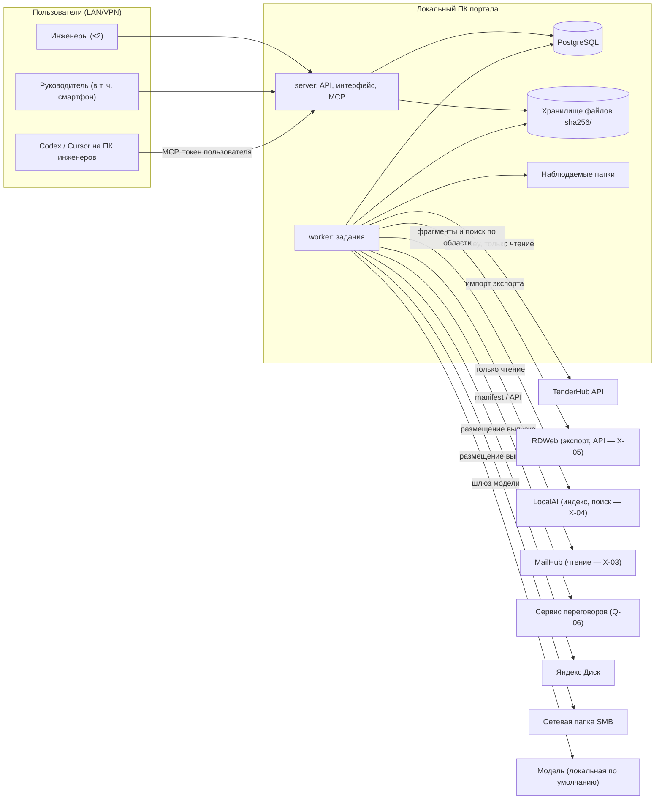

# Контур КП — архитектура (обзор)

Этап 01. Решения — в `docs/adr/`, модель данных — `data-model.md`, состояния — `state-machines.md`, контракты — `docs/contracts/`, инварианты — `invariants.md`, план тестирования — `test-plan.md`, сквозные сценарии — `walkthroughs.md`, неизвестные — `unknowns.md`.

## 1. Контекст

Портал не публикуется в интернете. Все внешние вызовы делает `worker`; `server` не ходит во внешние системы при обработке пользовательского запроса, кроме проверки состояния интеграций по сохранённым данным.

## 2. Процессы

| Процесс | Ответственность | Не делает |
|---|---|---|
| `server` | аутентификация, права, команды и чтение API, MCP, раздача интерфейса, `/health`, `/ready` | внешние вызовы, длительные операции |
| `worker` | задания очереди, адаптеры интеграций, генерация файлов, размещение, инвалидация | принятие решений за человека |
| PostgreSQL | данные, очередь, аудит, полнотекстовый индекс фрагментов | — |

Обоснование состава — ADR-001; очередь — ADR-004; запуск и восстановление — ADR-011.

## 3. Модули

| Модуль (`packages/core` + `packages/db`) | Таблицы | Основные команды | Задания |
|---|---|---|---|
| Доступ | `app_user`, `user_role`, `tender_member`, `session`, `api_token`, `mailbox`, `mailbox_access` | вход, выход, назначение на тендер, выпуск MCP-токена, доступ к ящику | — |
| Тендеры и этапы | `tender`, `tender_stage`, `stage_calculation_source` | создать тендер и этап, связать версию TenderHub | — |
| Источники | `blob`, `document`, `document_revision`, `document_occurrence`, `import_batch`, `import_item`, `source_set*` | загрузить файлы/архив, подтвердить группировку, изменить и заморозить набор источников | `import`, `watch_folder` |
| Распознавание и доказательства | `recognition_run`, `recognition_page`, `evidence_fragment`, `fragment_index_state` | импорт экспорта RDWeb, превью цитаты | `recognition`, `index_fragments` |
| Поиск | — (читает фрагменты) | поиск по области (ADR-008) | — |
| Расчёт | `calculation_capture`, `calculation_revision`, `calculation_position`, `calculation_line`, `position_lineage` | запросить выгрузку, подтвердить сопоставление позиций | `capture_calculation` |
| Коммуникации | `communication*`, `qa_form`, `qa_item`, `negotiation_*`, `transcript_*` | импорт писем, Q&A, переговоров; подтверждение связи с тендером | `mail_sync`, `import_eml`, `import_negotiation` |
| Требования | `requirement*`, `coverage_link` | принять/отклонить кандидата, правка формулировки, покрытие | `extract_requirements` |
| Проверки и разногласия | `review_run`, `review_check_result`, `model_suggestion`, `finding*`, `discrepancy*`, `decision`, `question`, `risk_acceptance`, `evidence_dependency` | запуск проверки, переходы замечаний, оси разногласий, решения, принятие гипотез | `review`, `invalidate` |
| Приложения | `application_template`, `template_revision`, `approved_wording`, `application_draft`, `draft_field_*` | заполнить и подтвердить поля | `suggest_fields` |
| Выпуск | `release_candidate`, `candidate_file`, `approval`, `readiness_hold`, `release` | сформировать кандидата, согласовать, вернуть, отозвать, решить удержание, выпустить | `assemble_candidate` |
| Размещение и отправка | `delivery*`, `send_event` | повторить размещение, решить конфликт, зарегистрировать отправку | `deliver`, `verify_delivery`, `match_sent_mail` |
| Сравнение | `comparison`, `change_explanation` | сравнить выпуски, подтвердить причину | `compare_releases` |
| Сервисные | `audit_event`, `job`, `idempotency_record`, `integration_status`, `sync_cursor`, `setting` | настройки, статус интеграций | `recovery`, `integrity_check`, `backup_manifest` |

## 4. Рабочий процесс спецификации (§6) по модулям

| Шаг | Модуль | Ключевые записи |
|---|---|---|
| Создать/связать тендер | Тендеры | `tender`, `tender_stage`, `stage_calculation_source` |
| Получить документы | Источники | `blob`, `document_revision`, `document_occurrence` |
| Обработать | Распознавание | `recognition_run` (RDWeb), `evidence_fragment` |
| Сформировать требования | Требования | `requirement`, `requirement_revision`, `requirement_evidence` |
| Проверять текущий расчёт | Расчёт, Проверки | `calculation_revision` (`provisional`), `review_run` |
| Получить закрытую версию TenderHub | Расчёт | `calculation_revision` (`verified` после X-01) |
| Финальная проверка | Проверки | `review_run` на замороженной `source_set_revision` |
| Решения по разногласиям | Проверки | `finding`, `discrepancy`, `decision` |
| Заполнить приложения | Приложения | `draft_field_value` |
| Сформировать файлы кандидата | Выпуск | `release_candidate`, `candidate_file`, манифест |
| Согласовать руководителем | Выпуск | `approval` |
| Выпустить | Выпуск | `release` |
| Разместить в двух хранилищах | Размещение | `delivery` × 2 |
| Зафиксировать отправку | Отправка | `send_event` |
| Сравнить следующий этап | Сравнение | `comparison`, `change_explanation` |

Закрытие расчёта, согласование, выпуск, размещение и отправка — разные записи разных таблиц (I01).

## 5. Сквозные механизмы

| Механизм | Где описан |
|---|---|
| Неизменяемость и классы таблиц | ADR-002, `data-model.md` §1 |
| Хранилище по хэшу | ADR-003 |
| Очередь и восстановление | ADR-004 |
| Деньги, время, `If-Match`, `Idempotency-Key` | ADR-005 |
| Права и изоляция | ADR-006 |
| Адаптеры и источники истины | ADR-007, `docs/contracts/adapters.md` |
| Область поиска | ADR-008 |
| Модель и правила | ADR-009 |
| MCP | ADR-010, `docs/contracts/mcp-tools.md` |
| Эксплуатация | ADR-011 |
| Инварианты и механизмы исполнения | `invariants.md` |
